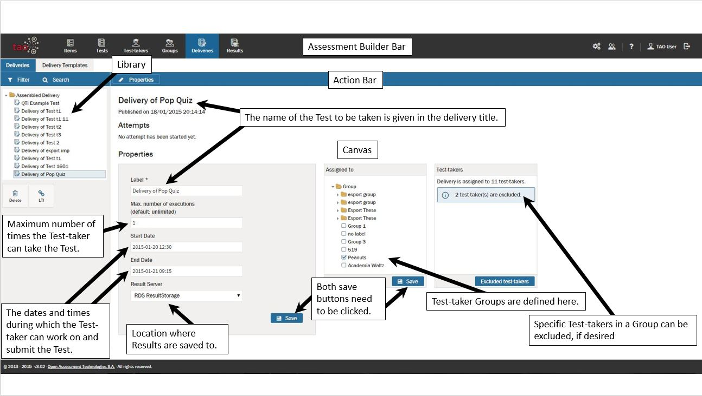

<!--
created_at: 2015-05-15
authors:         
    - "Ben Angel"    
--> 

# What is a Delivery?

*"A delivery is the process that coordinates the rendering and delivery of tests and the evaluation of responses to interactions to produce scores and feedback."* - Based on the Question and Test Interoperability standard, published by IMS Global

>A delivery is the assembly of all information required to assign and send out tests to selected Test-takers. This includes such information as the exact [Test](../terminology/what-is-a-test.md) to be delivered, the exact group of Test-takers to receive the test, and the circumstances (in particular the time frame) in which the Test may be taken.

Deliveries effectively define the lifecycle of an item session. This cycle begins when the Test-taker becomes eligible for Test Delivery, a condition that is set during the actual authoring of the delivery. In simplest terms, the cycle continues through the Test-taker's interaction with the Test's [Items](../terminology/what-is-an-interaction.md) selected for the candidate, and ends when Test Results for all interactions are determined. In some instances, more than one attempt to interact may be allowed. In such cases, the Delivery lifecycle continues until there are no remaining attempts permitted. The cycle finishes when the results are recorded; these may or may not be displayed to the Test-taker, but they are definitely made available to the test administrator after the lifecycle is complete.
