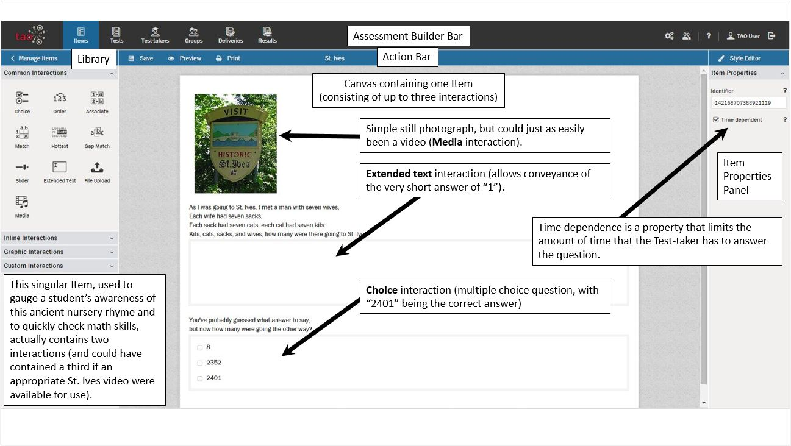

<!--
created_at: 2016-12-15
authors:         
    - "Catherine Pease"
--> 

# What is an Item?

*"An item is a set of interactions (possibly empty) collected together with any supporting material and an optional set of rules for converting the candidate's response(s) into assessment outcomes."* - Question and Test Interoperability standard, published by IMS Global.

>Items are the basic building blocks for [assessments](../tests/what-is-a-test.md). They may contain a single interaction (a simple item), or several closely-related interactions, all the same type or of a mixture of types (a composite item). Note that items contain [interactions](../interactions/what-is-an-interaction.md), but are not interactions themselves. 

Beyond the interactions contained within them, Items  may include titles, images, and text, which help the Test-taker understand the expectations and context of the assessment material presented within. Item complexity ranges from simple items with a single interaction to composite items with multiple interactions.

*Note: Items are locked when other users are working on them.*
