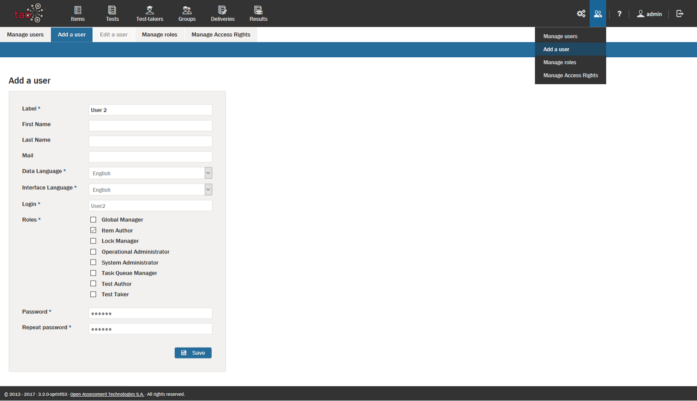
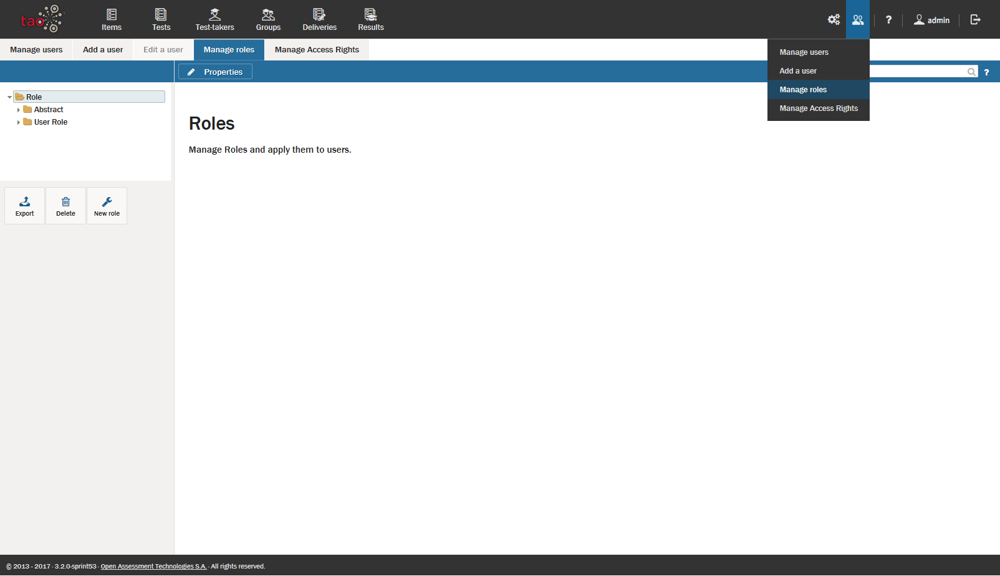
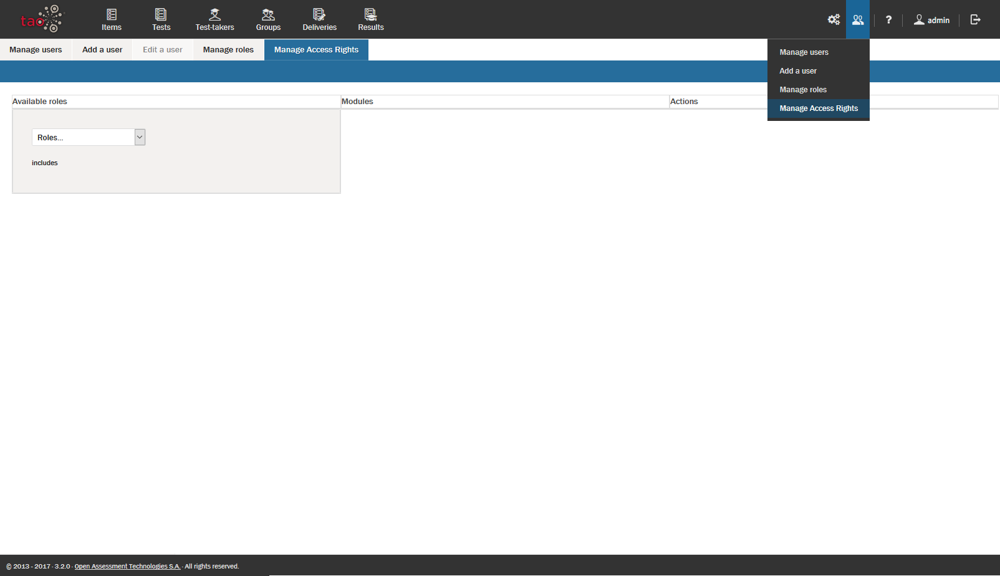

<!--
created_at: 2016-12-15
authors:         
    - "Catherine Pease"
--> 

# User Management

>User Management in TAO involves adding and editing user profiles, assigning roles to specific users, and granting users access rights to specific areas of TAO.
 

These user-related functions, which are accessible to [Global Managers](../appendix/glossary.md#global-manager), are organized in four functional tabs: 

- **Manage Users**
- **Add A User**
- **Manage Roles**
- **Manage Access Rights**. 

All User Management functions can be found under the Users icon (depicted with two heads), located on the right-hand side of the Assessment [Builder Bar](../appendix/glossary.md#builder_bar). 

**1. ** Adding a New User

This tab allows new User accounts to be created on your TAO system. These can include any manager or any [Test-taker](../appendix/glossary.md#test-taker).

Click on the *Add a user* tab. Fill in the following fields in the panel that appears in the canvas area: 

- **Label** (full name or easy-to-remember nickname)
- **Data Language** (language used by administrators)
- **Interface Language** (language used by the user)
- **Login** (must be unique, cannot be changed once set)
- **Roles** (as desired) 
- **Password and Repeat Password** (to be given to the user). 
 
The *First Name*, *Last Name*, and *Mail* (E-mail) fields are optional.

**2.** Managing Users

This tab provides an overview of all the users registered in your TAO system. Included are managers and test-takers, and any other roles assigned to the accounts of individuals to whom you have granted access.

To edit these, click on the *Manage Users* tab. Find the profile that you wish to edit. Review the information in the table, and then click the *Edit* button. You can edit any of the data in the panel which appears.

*Note: It is not possible to change the login of an existing user. If there is a login conflict, it will have to be resolved without editing this field.*

This is the procedure used for such actions as changing passwords, e-mail contact information, etc. Alternatively, this is also the tab to use to remove profiles, which you can do by clicking on the appropriate button on the right of the canvas.

**3.** Managing roles

This tab can be used to assign roles to specific users. 

To do this, select *manage roles*. In the canvas which appears there will be two panels sitting side-by-side. The left panel shows the tree of roles with classes (folders). The right panel is by default empty. In the left panel, select either a single role. These will have a label, and the roles assigned to this label can be edited in this window. You can create your own role (by clicking New Role) and select which roles you want to be included by ticking the checkboxes next to the  role, or combination of roles which are to be assigned to the individual(s). 

The most important roles are:

**Global Manager:** The global manager has access to the entire platform, apart from to system components such as the [extension manager](../appendix/glossary.md#extensions-manager).

**Item Author:** An Item Author can create, edit or delete items.

**Lock Manager:** Some TAO extensions allow items to be locked, in order to avoid concurrent editing. The *Lock Manager* can unlock these items (something that normally only the item owner can do).

**System Administrator:** The System Administrator has access to the entire platform with full permissions except for test taking.

**Proctor:** The Proctor runs tests, can authorize test takers, and can pause or end tests. This role is only available if *taoProctoring* is installed. Tests can, however, be delivered without proctoring.

**Test Author:** A Test Author can create, edit or delete tests.

**Test Taker:** The Test-taker can take tests. (This role is normally assigned by the Test-taker Manager).

Select the users who will be assigned to this role by clicking on the *Assign users* button in the *[Action Bar](../appendix/glossary.md#action-bar)*. A list of TAO users will appear. Select the checkboxes of the users to whom you wish to assign this role. When all the desired users are selected, click *Save*.

**4. ** Managing Access Rights.

This tab provides the means for changing the access rights of roles within your TAO system. Access to modules can be changed in this tab, by either adding or removing them from a specific role.

To customize or edit access rights for different roles, click on the *Manage Access Rights* tab. In the menu which appears in the first column in the canvas area, select the role you wish to modify. Review the *Modules* list in the second column. Check the appropriate boxes for those modules you want the role to access (or uncheck those boxes you no longer want the role to access). 