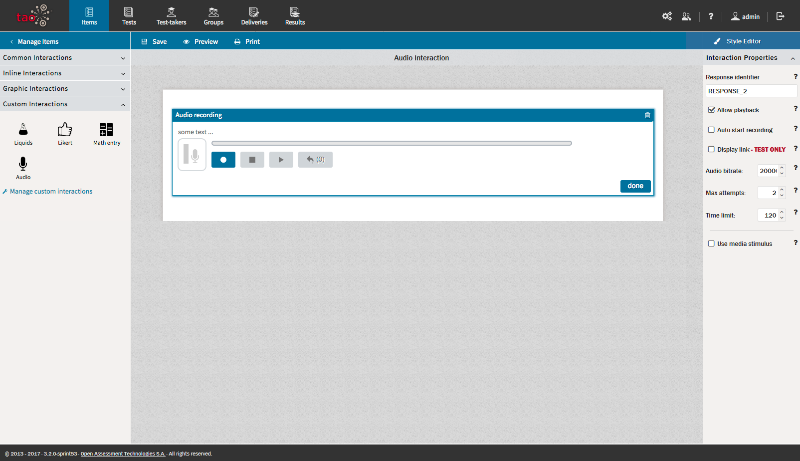
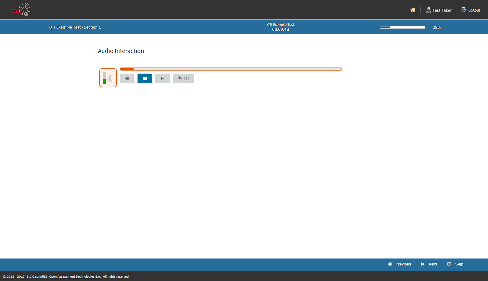

<!--
tags: []

--> 

# Audio Interaction

> The Audio Interaction allows a Test-taker to record short audio sequences, and is used to record a test-taker's speech to evaluate speaking ability.

The Audio Interaction belongs to the group of *Portable Custom Interactions*, so it is not a classical QTI interaction.

Editor View

Test-Taker View

