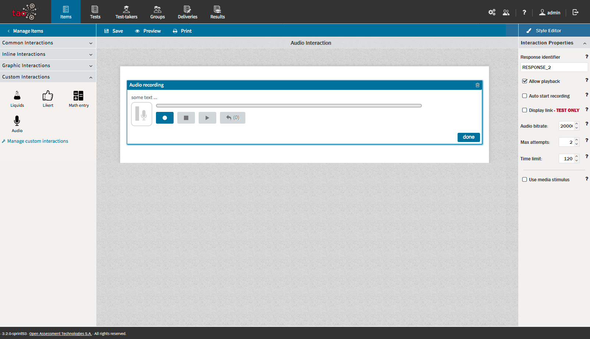
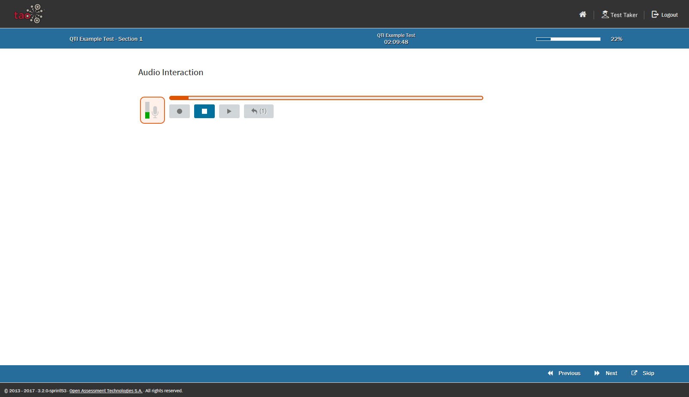

<!--
tags: []

--> 

# Audio Interaction

> The Audio Interaction allows a Test-Taker to record little audi sequences

The Audio Interaction belongs to the group of *Portable Custom Interactions*, so it is not a classical QTI interaction.

Editor View

Test-Taker View

