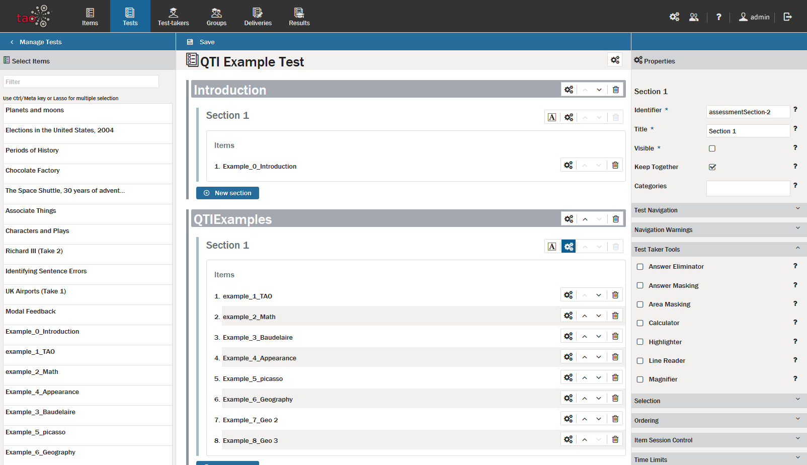
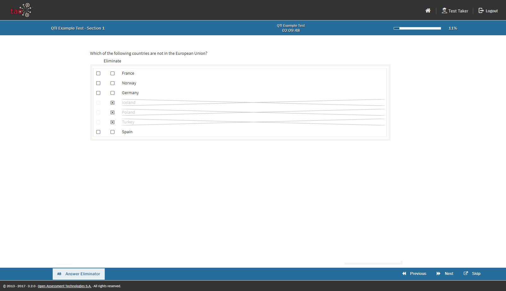
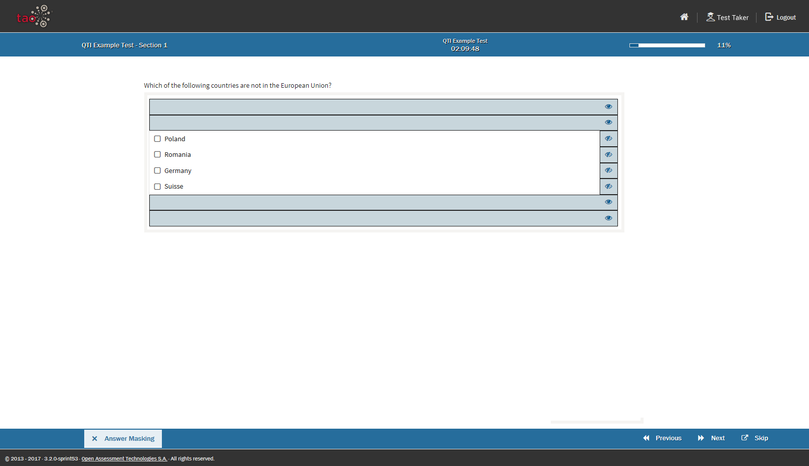
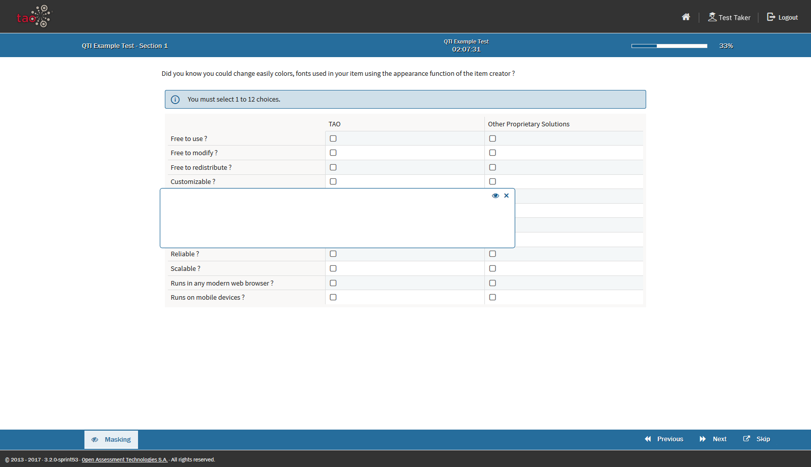
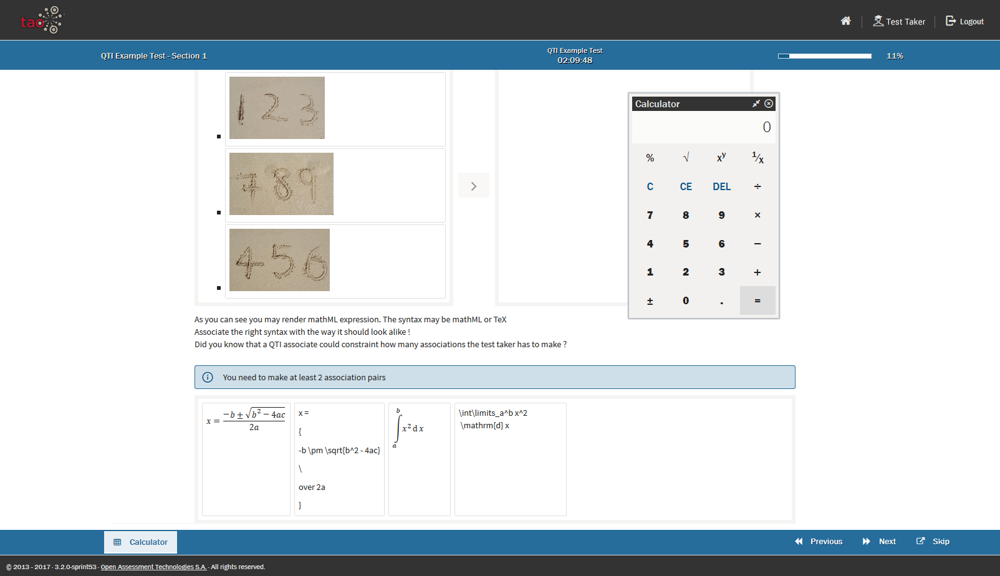
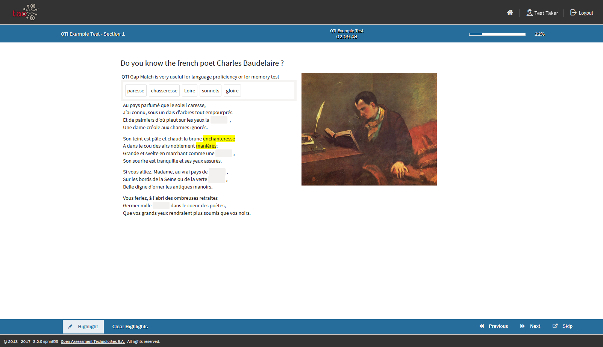
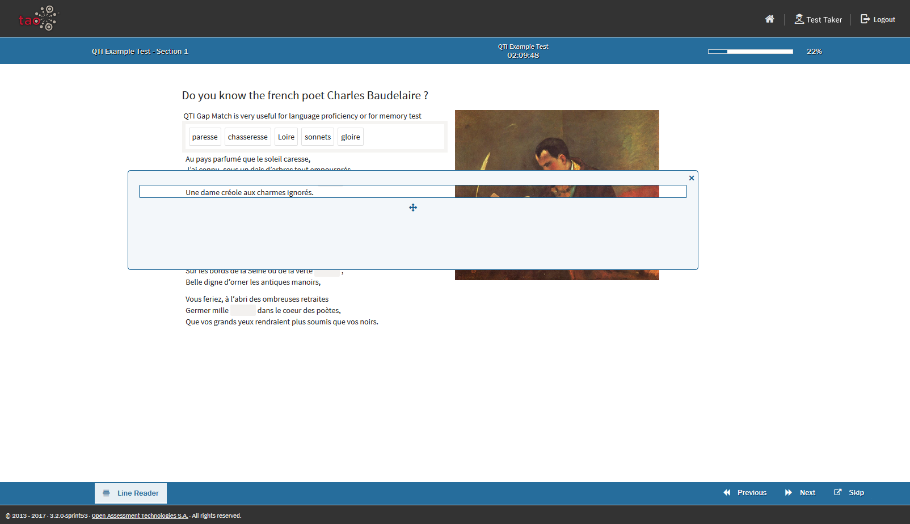
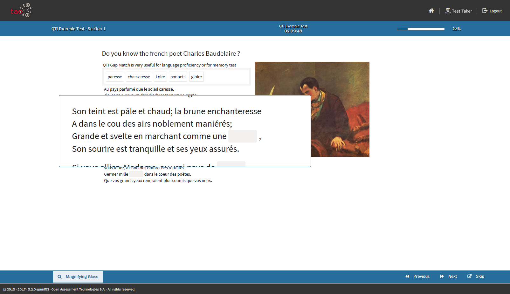

<!--
tags: []

--> 

# Test-Taker Tools

> A set of tools that will help the Test-Taker. The majority of them are accommodation tools that aim to improve accessibility.

The test taker tools can be configured in the right sidebar either for a whole section or on a per-item basis. To display them click on the gears on the little toolbar on each section or item.

Test-Taker Tool Configuration on a Section
 
## Answer Eliminator
Allow the test-taker to eliminate answers in some interactions. Makes more sense when you have a long list of answer choices and a learning disability
Allow the test-taker to mask and unmask answers in choice interactions

## Answer Masking
Allow the test-taker to mask and unmask answers in choice interactions

 
## Area Masking
Allow the test-taker to mask parts of the item with a movable mask.

## Calculator
Allow the test-taker to use a basic calculator.

## Highlighter
Allow the test-taker to highlight parts of the item text.

## Line Reader
Allow the test-taker to visually isolate a line of text.

## Magnifier
Allow the test-taker to use a movable magnifier tool.

