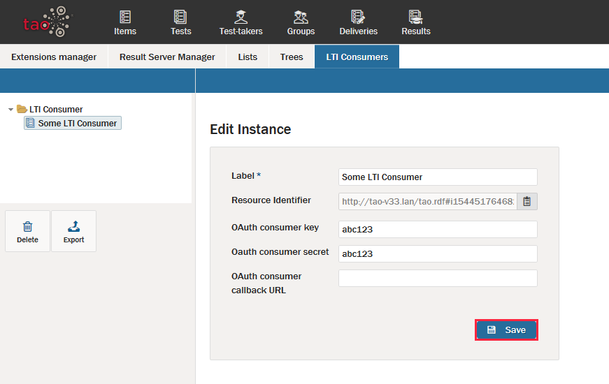

<!--
created_at: 2016-12-15
authors:         
    - "Catherine Pease"
--> 

# Executing TAO Deliveries using LTI Applications

>Through the [Learning Tool Interaction (LTI) standard set forth by IMS Global Learning Consortium](http://www.imsglobal.org/activity/learning-tools-interoperability), LTI users of applications such Moodle can make use of TAO-designed [Tests](../appendix/glossary.md#test) and deliver them to students through an LTI platform, such as the Moodle platform. 

>"The principal concept of LTI is to establish a standard way of integrating rich learning applications (often remotely hosted and provided through third-party services) with platforms like learning management systems, portals, learning object repositories, or other educational environments." (IMS Global Learning Consortium) 

This chapter demonstrates how an interface between TAO and Moodle can be set up and executed. This allows [Test Authors](../appendix/glossary.md#test-author) to take advantage of the ease of using TAO, whilst also allowing test administrators ([Tenant Administrators](../appendix/glossary.md#tenant-administrator)) to deliver tests through the popular Moodle platform with which they are familiar. As an administrator, you must have Administrator privileges for both TAO and Moodle. As a teacher, you must have Teacher privileges in Moodle and Test [Delivery](../appendix/glossary.md#delivery) privileges in TAO, and TAO-Moodle interconnectivity must be set up prior to executing the delivery.

**Setting up a TAO-Moodle delivery as an LTI Administrator**

**1.** Ensure that TAO is configured for LTI.

Your TAO environment may already be configured for LTI, in which case you will find *taoLTI* in the list of extensions installed. 

If not, you will need to install the required extensions through the [Extensions Manager](../appendix/glossary.md#extensions-manager). To open the Extensions Manager, hover over the *Settings* icon (depicted by interlocking cogs in the [Assessment Builder Bar](../appendix/glossary.md#assessment-builder-bar)), and click on *Extensions Manager*. Select and install the extensions *ltiDeliveryProvider* and *ltiProvider*, then reload the TAO page. If one of the required extensions is not in the list of *Available Extensions*, it will need to be added. See the section [Adding an Extension](../advanced-features/add-an-extension.md) for information on how to do this.

Go back to *Settings*, and click on the *LTI Consumers* tab. Select the LTI Consumer class (folder), and click on *Add Consumer*. Name (*label*) the new consumer, and fill in an easy-to-remember *consumer key* and *consumer secret* (this is used during integration). The callback URL can be left blank. Finally, click on *Create*. If the consumer does not immediately appear, reload the page and it should come up. Record the URL of the page - this is your Tool Base URL.

**2.** Ensure Moodle is correctly configured.

Go to Site Administration in the Moodle platform. Under *Advanced Features*, open the pull-down menu for *Plugins*. Pull down *Activity modules* and then go to *Manage activities*. 

Next, open *Settings* within *External Tools* and click on *Add external tool configuration*. Add an appropriate name to the new configuration and then enter the Consumer key and Shared secret which you used in TAO. 

When prompted, enter the Tool Base URL. The Tool Base URL is TAO_ROOT_URL + '/ltiDeliveryProvider/DeliveryTool/launch'. (If you don't know the URL of your TAO installation, return to the TAO *back office* home, and copy the URL, removing 'tao/Main/index' from the end.
For example, if your TAO home is 'http://localhost/tao24/tao/Main/index', then your root URL would be 'http://localhost/tao24/'.)

Finally, click on *Save Changes*.

**Executing a TAO delivery in Moodle as an LTI Teacher**

**1.** Create and Compile a new delivery within TAO.

Follow the steps used in [Create a New Delivery](../deliveries/create-a-new-delivery.md). This should create an action without an icon called an LTI export. Copy the URL that this action generates.

**2.** Deliver the test in Moodle.

First, open your course in *edit* mode, then click on *Add an activity or resource*. Select *External Tool*, and click *Add*. 

Give the activity an appropriate name and then paste the URL taken from TAO in the previous step into the *Launch URL* field. This should produce a green check mark to the right of the URL. 

Finally, click *Save* and then return to the course. Your TAO delivery should now have been added to the Moodle course.

**3.** Test out the Delivery in Moodle.

Log in using a test account (a [Test-taker](../appendix/glossary.md#test-taker) profile set up for test purposes, to ensure that the delivery works as planned). Select the course and then click on the activity. If everything works as desired, no further action will be required. If not, you will need to troubleshoot the delivery in TAO, ensuring that it is fully functional.
