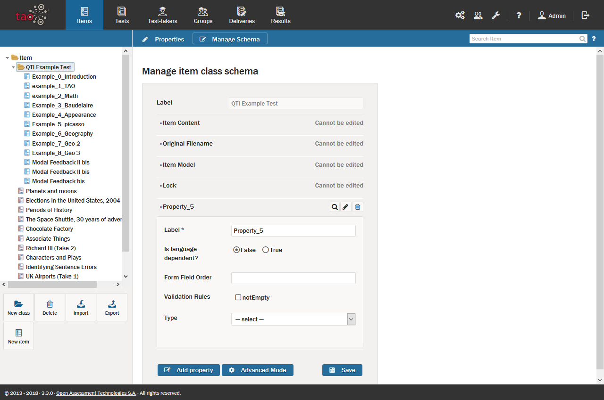

<!--
created_at: 2016-12-15
authors:         
    - "Catherine Pease"
--> 

# Metadata Management

>As an institution's collection of [Items](../appendix/glossary.md#item) grows, most test authors will find it increasingly unwieldy to locate the right set of [Interactions](../appendix/glossary.md#interaction) for a given [Test](../appendix/glossary.md#test). TAO's [Metadata](../appendix/glossary.md#metadata) offers a way of finding relevant Items for your Tests easily, even when there are hundreds or thousands of Items to choose from. 

*Note: Although this section only covers Metadata that apply to Items, the procedures for applying Metadata to Tests, Test-takers, Groups, and Deliveries are very similar.*

[Properties]](../appendix/glossary.md#properties) define the metadata entered for your items, and can be added to any item. Metadata is useful as it can help identify items used in a specific course, for a specific instructor, within a specific Test, etc. Searches identify these specific items so that they can be easily accessed.

*Note: The Search option is only available for advanced installations, and does not form part of the standard release.*

## Inserting or editing properties

**1.** Click on an Item [Class](../appendix/glossary.md#class) to add or edit properties. 

This brings up the properties window for that particular class (folder). Properties define the metadata which apply to a given Item. The properties window for the class you are reviewing allows you to change the label of the class and shows the properties which comprise the metadata set for all the items in that class. For items, the first four properties listed cannot be edited: *Item Content*, *Original Filename*, *Item Model*, and *Lock*. Other properties in the list of class metadata can be both edited and, if necessary, deleted.

**2.**  To add a new property in the class properties window, click on the blue *Add Property* button below the property list.

This adds a new property at the end of the list. Before it can be used in TAO, you will need to add information to it.

**3.** To edit a property in the properties window for the class, click on the *Edit* icon.

The *Edit* icon is located on the right, and looks like a pencil.

When in *Simple Mode* (default), the *Edit* icon brings up a box in which the item's properties can be edited. There are four fields to fill in. The first field allows the Property Label (name) to be changed from *Property_X*. The second field asks if the property is language dependent; this indicates if the value of this field can be translated (the default is *false*). The third field asks for the *Form Field Order*: this defines the position of the new property in the list of all the properties pertaining to that item. The fourth field asks for the field type. This is important as it describes how the property is defined and modified. A drop-down menu provides six basic choices:

- **Text** (three options: *short-field*, *long-box*, and *long-HTML editor*)
- **List** (three options: *Single choice radio button*, *single choice drop down menu*, and *multiple choice check box*)
- **Tree** (*multiple node choice*)
- **Calendar**
- **Password**
- **File**

When in *Advanced Mode* (which can be selected once the *Edit* icon has been clicked), the box is different. The first two fields are the same (*Label* and *Is Language Dependent*), but the Form Field Order and Type are replaced with a Widget range, which provides a drop-down menu for selecting a property type (many more options are presented here), and a Resource Window, through which a property resource type can be selected.

Once you've selected the values which apply to this property, click on the blue *Save* button: This will save and reload the window. Remember that you can delete the properties you add by clicking the *trash can* icon.

**4.** To edit a list used with an existing property, hover over the cogs icon in the [Assessment Builder Bar](../appendix/glossary.md#assessment-builder-bar) and select *Lists* from the drop-down menu.

A window will appear showing all the available Lists which can be used with the properties in your TAO [Library](../appendix/glossary.md#library). On the right-hand side of the window you will find all the lists which might apply to any Item set created in your TAO set-up. These can be edited or deleted here.

On the left-hand side of the window is the option to create a new list. To create a list, you need to enter the name of the new list, as well as the number of elements in it. 

## Using metadata to search for an item

*Reminder: The Search option is only available for advanced installations, and does not form part of the standard release.*

**1.** Select the criteria you wish to use in your Search for items.

In the search box on the right of the blue [Action Bar](../appendix/glossary.md#action-bar), enter the value of any property for which you wish to retrieve the relevant items - for example, you may wish to retrieve all items containing multiple choice interactions. This can be any of the metadata you entered in the properties description: the *Label* field (if items are named for easy retrieval), *Language* field, item *Type*, or any other properties you defined for the items in the class for which you are carrying out the search.

To make your search more specific, it is also possible to use the name of the property as well as its value to guide the search. For example, you may wish to retrieve all items with a certain *label*. In this case the search criteria needs to take the form of the following example: *Label:biology*.

**2.** Once you've selected the filter criteria for your search, click on the blue *Search* button.

This will bring up a list of items which meet your filter criteria. In this window, you can select any item you wish to open. This could be to preview, or to author, or simply to identify where the Item is located for use in building your test.
