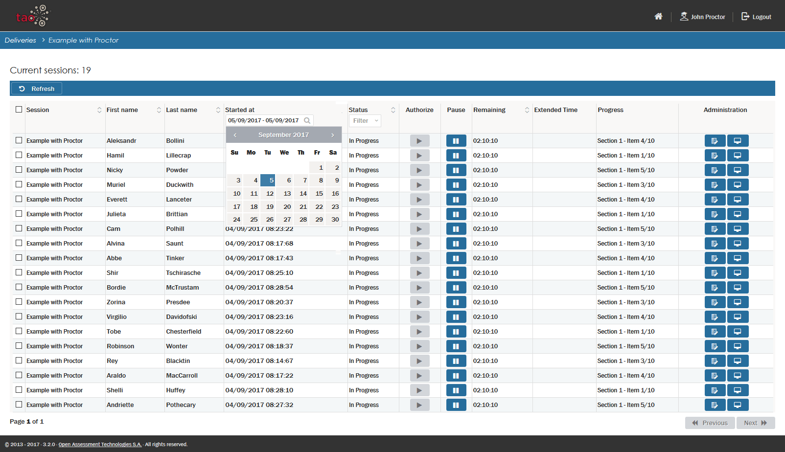

# Proctoring

> The Proctoring extension allows the administrators of deliveries to monitor a [Delivery](../appendix/glossary.md#delivery). By assuming the role of proctor, a teacher or administrator is able to follow the progress of [Test-takers](../appendix/glossary.md#test-taker) sitting a [Test](../appendix/glossary.md#test), submit a report on the status of the delivery and also intervene if necessary. There are two roles involved, a [proctor](../appendix/glossary.md#proctor) and one or multiple test-takers.
 
Follow the steps below to assign a proctor to a delivery.

**1.** Create a user with the role *proctor*

See the [User Management section]({AG}/management/users.md) for details on how to do this.

 

**2.** Create a delivery which requires proctoring

See the [Create a new Delivery section](../deliveries/create-a-new-delivery.md) for details on how to create a delivery.

The properties pertaining to your new delivery will appear on the [Canvas](../appendix/glossary.md#canvas) in the middle of the screen. Check the box *Require proctoring* at the bottom of the properties list, and save your delivery.

 

**3.** Log in as proctor

A list of all the deliveries which require a proctor will appear.

 

**4.** Click on *monitor* for the delivery you wish to proctor.

A list of all the test-takers who are logged in for this session will appear. You can filter the test-takers either by date or by status (started, terminated, etc):

*Note: You will need to click on 'refresh' to see test-takers who have logged in since you logged in as proctor. If none are logged in, and you wish to continue, proceed to step 5.*

You can now carry out the following actions for this delivery:

- **Authorize**: authorize a test-taker or group of test-takers to start the session

- **Pause**: Pause a session (e.g. if there is an interruption)

- **Report**: Report an irregularity

- **Terminate**: Stop a session (e.g. if there is a power cut)

- **History**: Check the history of the session

These actions can be carried out for individual test-takers or for all test-takers.

*Note: the above steps are only possible if one or more test-takers have been assigned to the delivery, and are logged in to a session. If no test-takers are logged in to the session, it is not possible to monitor the delivery.*

Carry out Step 5 below if you wish to simulate a test situation in order to experiment with the proctoring option. 

**5.** Testing the proctoring functionality 

To try out the proctor functionality you will need to simulate a test scenario. To do this, log in as both proctor and test-taker. If this is to be done on one computer, you either need to use two different web browsers, or one browser which is set up in one instance in regular mode and in another instance in private mode.

Log in as a test-taker on one of the browsers, and as a proctor on the other. Continue the procedure above from step 4.
