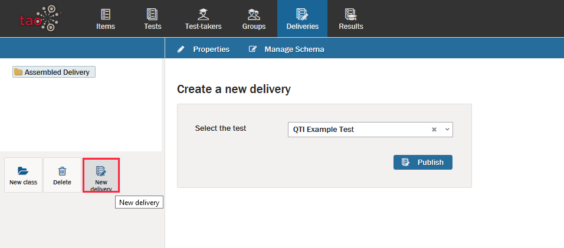

<!--
created_at: 2016-12-15
authors:         
    - "Catherine Pease"
--> 

# Create a New Delivery

>Assembled [Deliveries](../deliveries/what-is-a-delivery.md) provide the means of publishing and administering [Tests](../appendix/glossary.md#test). These govern when a test is taken by selected individuals or [Groups](../appendix/glossary.md#group) of [Test-takers](../appendix/glossary.md#test-taker) and how long tests will be. A delivery can only be assembled after the creation of [Interactions](../appendix/glossary.md#interaction), the assembly of the test, the creation of test-taker profiles, and the gathering of test-takers into formal groups.

Let's walk through the steps of creating a delivery.

**1.** Click on the _Deliveries icon_ [Delivery](../resources/_icons/delivery.png) in the [Assessment Builder Bar](../appendix/glossary.md#assessment-builder-bar). 

This will take you to the Deliveries page, and will show the last delivery that has been created. On the left-hand side of your screen you will see the [Delivery Library](../appendix/glossary.md#delivery-library) of existing deliveries. The last delivery which was created will be highlighted in the library. In this tour, however, you will create a new delivery.

**2.**  Click on the *New delivery* icon [Delivery](../resources/_icons/delivery.png) in the button bank under the library.

This brings up a dialog box entitled *Create a New Delivery*, which asks for a test selection. From the pull-down menu, select the test that is to be sent to test-takers in this delivery. Once selected, click *Publish*. 

A properties panel will come up.

*Note: To create a new delivery in a different folder, select the desired folder in the library, and then click on the New delivery icon in the button bank. To create a new folder (in TAO these represent new classes), click on New class in the button bank, and then give it a label. Highlight where to put the new folder relating to the new class.*

**3.** Set the delivery properties. 

**Label:** The default name of the delivery is 'Delivery of *Test Name*'. This can be changed as needed. 

**Title:** Give your delivery a title.

**Maximum Executions:** If left empty, test-takers may take the delivered test an unlimited number of times. Setting this number to any non-zero integer will limit the test-takers to that number of attempts.

**Start Date** and **End Date:** These fields establish both the earliest date and time and the latest date and time the test can be taken. Clicking on either date field provides a graphical interface which allows you to set the date and time (using a calendar, and slider controls for hours and minutes). However, it is also possible to provide the date and time by typing them in manually in the following order: year, month, day, and 24-hour clock (YYYY-MM-DD HH:MM)

**Display Order:** This allows you to specify the order in which the deliveries are presented.

As a test-taker you are presented with a list of all the deliveries which are assigned to you. These are normally unordered unless you set *display order* to a numeric value. This numeric value defines the position of delivery in the *Available* list.

**Access:** If the *Guest Access* box is checked, people who are not registered as test-takers can view the delivery. This enables a test author or an administrator to preview the test without having to assign it to a [Test Center](../appendix/glossary.md#test-center) to try it out.

**Test Runner Features:** Checking the *Security plugins* box ensures restricted access to the delivery by showing it in forced full-screen mode, and detects certain key presses, such as print screen for creating a screenshot. When combined with proctoring, the test will be halted upon detection of the relevant key presses, or of loss of focus (if the test-taker uses alt-tab or exits full screen mode).

**4.** Assign the test to a group of test-takers in the panes on the right of the [Properties Panel](../appendix/glossary.md#properties-panel).

The *Assigned to* canvas contains all available groups of test-takers. Select a group, and click the blue *Save* button below. If there are test-takers in the group who, for whatever reason, should not take this exam (due to absence, remedial assignments, etc.), click the blue *Excluded Test-takers* button at the bottom of the test-takers canvas. To move a person from *assigned* status to *excluded* status, simply click on that person's name in the *Assigned* column. Click *Save* to close the pop-up window.
