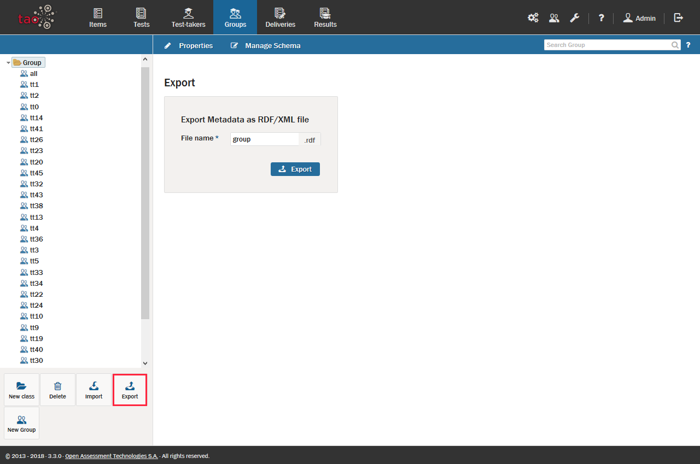

<!--
created_at: 2016-12-15
authors:         
    - "Catherine Pease"
--> 

# Exporting Groups

>Formal [Groups](../appendix/glossary.md#group) of [Test-takers](../appendix/glossary.md#test-taker), such as laboratory or lecture groups, may be assembled on almost any computer that has access to TAO. However, there will be situations in which sharing the metadata of formal test-taker groups will be useful. For instance, an instructor may need to transfer metadata for an entire class to a substitute or replacement teacher during an absence. Test-taker groups can be shared in a few easy steps.

**1.**  Click on the Groups icon in the [Assessment Builder Bar](../appendix/glossary.md#assessment-builder-bar).

**2.**  Click either on a Class  or a Group symbol  in the Group [Library](../appendix/glossary.md#library) on the left-hand side to select one or multiple groups.

**3.**  After the selection, click *Export* in the button bank below the library.

In the dialog box, confirm that the folder or group metadata file highlighted is the one that should be exported as a Resource Description Framework (RDF) file.

**4.**  Click the blue *Export* button in the dialog box to continue with the export.

**5.**  Select the location to which you want to export your group file, and then click *Save*.

The group metadata can then be transferred either to a data storage device or a computer network. The next step in the transfer is to [import the group file](../groups/importing-groups.md) onto the desired computer.

