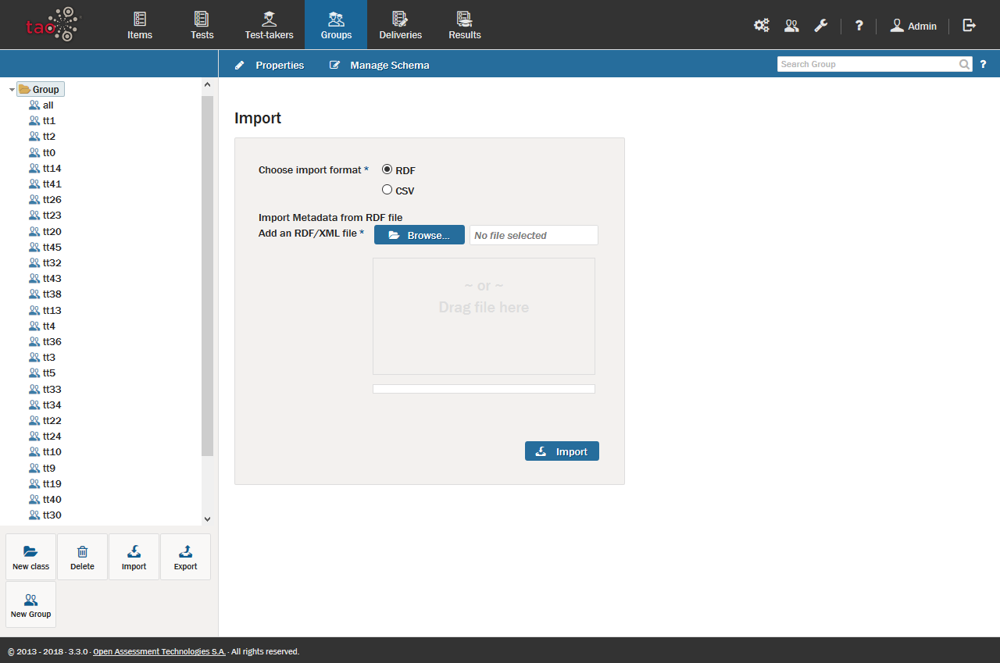

# Importing Groups

>[Group](../appendix/glossary.md#group) metadata files can be taken from any computer and imported onto any other computer that also has access to TAO. This is done using an operation called *Import*.

**1.**  Click on the *Groups* icon  on the [Assessment Builder Bar](../appendix/glossary.md#assessment-builder-bar).

This will take you to the [Group Library](../appendix/glossary.md#group-library), which you will see on the left.

**2.**  Click on the Class  in the library in which you wish to import the new group.

**3.**  Click on *Import* in the button bank below the library.

This opens a dialog box which asks you to select the format of the incoming group metadata. The supported formats are RDF (Resource Description Framework) or CSV (Comma-Separated Values).

**4.** Click the blue *Browse* button to find the file intended for import (alternatively, the file may be dragged and dropped into the box below the button).

**5.** Once the file is selected, click on the blue *Import* button.

This will import the [Test-taker](../appendix/glossary.md#test-taker) group into the Group library, after which its members can receive [Tests](../appendix/glossary.md#test).
