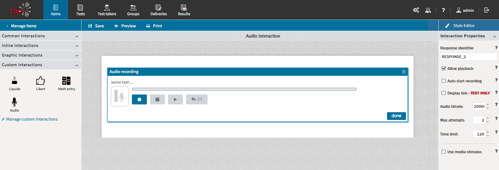
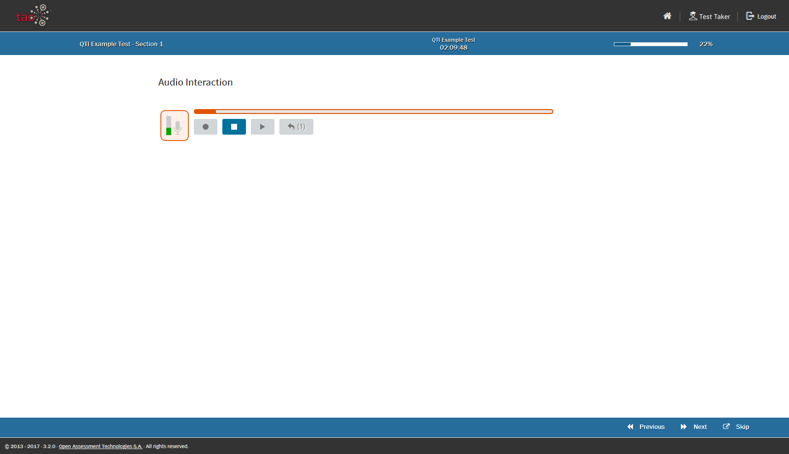

# Audio Interaction

> The Audio [Interaction](../appendix/glossary.md#interaction) allows a [Test-taker](../appendix/glossary.md#test-taker) to record short audio sequences, and is used to record a test-taker's speech to evaluate speaking ability.

The Audio Interaction belongs to the group of *Portable Custom Interactions*, so it is not a classical QTI interaction.

