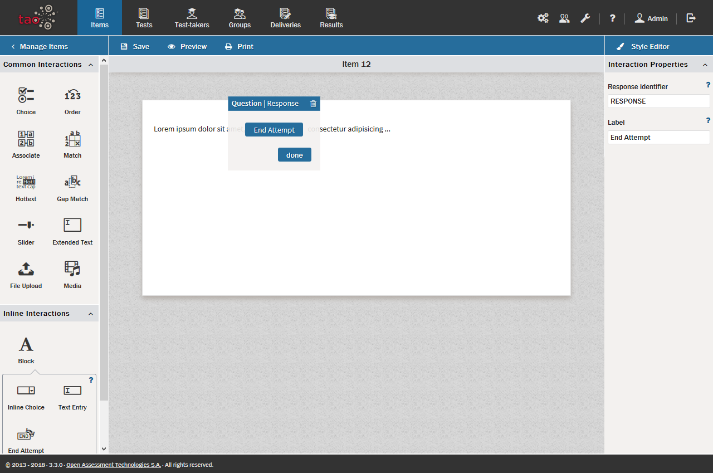

# End Attempt

>[End Attempt](../appendix/glossary.md#end-attempt) offers [Test-takers](../appendix/glossary.md#test-taker) the possibility of exiting from a particular [Item](../appendix/glossary.md#item) in a [Test](../appendix/glossary.md#test) without completing it.

*Note: Strictly speaking, the End Attempt interaction is not an interaction, but is implemented as such for the test-taker to be able to end his/her attempt at an item*

**1.** Including *End Attempt* in your test item.
 
The *End attempt* option can be added to a test item by means of an inline interaction inserted into a text block. 

After you have created a new Item, a [Text Block](../appendix/glossary.md#text-block) is inserted by dragging a *Text Block*  from the [Inline Interactions Library](../appendix/glossary.md#inline-interactions-library) below *Common Interactions* on the left, onto the blank Item and dropping it onto the [Canvas](../appendix/glossary.md#canvas). This creates a field (containing a sample text).

To insert the *End Attempt* button, drag the *End Attempt* icon   from the Inline Interactions library below *Common Interactions* on the left, onto the text field and drop it onto the canvas.

A blue button will appear in the text box, reading *End Attempt*.

A test-taker can click on this button during a test to indicate that he/she wants to give up on that particular item. The test normally then moves on to the next item.
