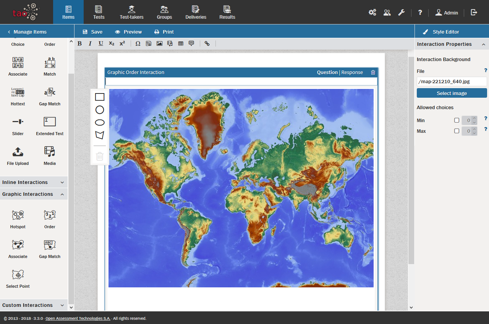

<!--
created_at: 2016-12-15
authors:         
    - "Catherine Pease"
--> 

# Graphic Order Interaction

>The Graphic Order [Interaction](../appendix/glossary.md#interaction) gives [Test-takers](../appendix/glossary.md#test-taker) the opportunity to demonstrate their knowledge of chronological order, orders of importance, etc. as seen on a graphic (map, photo, or other image).

>This interaction is one of a series of [Graphic Interactions](../appendix/glossary.md#graphic-interactions) (the others are covered in their own sections). All graphic interactions can be found in the [Graphic Interactions Library](../appendix/glossary.md#graphic-interactions-library). 

Once you have generated a new [Item](../appendix/glossary.md#item), and clicked on *Authoring* in the [Action Bar](../appendix/glossary.md#action-bar), follow the steps below to create a new Graphic Order interaction:

**1.** From the Graphic Interactions library near the bottom of the *Interactions library* on the left, drag the *Order* icon  onto the blank Item and drop it onto the [Canvas](../appendix/glossary.md#canvas).

**2.** Choose the desired background graphic.

A [Resource Manager](../appendix/glossary.md#resource-manager) window will appear with which you can select a background graphic. You can re-use a background  already in the resource manager, or you can upload a new one. To select one from the list of previously uploaded graphics, highlight the appropriate background graphic in the resource manager list and click the green *Select* button. To upload a new one, click on the blue *Add file(s)* button to browse the files on your computer, and then upload one to the resource manager by clicking the green *Upload* button.

Highlight the file you have chosen as your background by clicking on it, and it will appear on the right in the preview panel. Click *Select* in the bottom right of the window to continue.

A new authoring window will appear with the background graphic in the center of the canvas. Above the graphic there is a question field. On the left there is an [Associable Hotspot Panel](../appendix/glossary.md#associable-hotspot-panel) for inserting selected shapes that will represent *[Associable Hotspots](../appendix/glossary.md#associable-hotspots)* into the background graphic (these include four different shapes: rectangle, circle, ellipse, and polygon). Below the Hotspot Panel there is a trash can icon, which allows you to delete a poorly-placed or misshapen Hotspot.

**3.** Fill in the question field, where it says _define prompt_. 

This should cover such important information as what the background graphic represents, and what the test-taker is supposed to do in this interaction. 

*Note: See the section on [Interaction Authoring Tools](../interactions/interaction-authoring-tools.md) for details on text editing options such as using italics or bold text in your item, and inserting features such as shared stimuli or media, tables or formulae.*

**4.** Insert the *Associable Hotspots* onto the background graphic.

To insert a rectangle, click on one corner and drag it across the intended area the Hotspot is supposed to cover. To insert a circle or ellipse, select its center and drag outward or inward until the Hotspot is the right size. To insert a polygon, begin at one corner, then click on each corner in succession until the Hotspot is complete. You can make all the shapes bigger or smaller (or in the case of polygons change the shape), but if necessary, click on the problem Hotspot, then click the trash can to delete it, and then try again.

<aside class="optional-extras">
## Optional Extras when Creating a Task

The following options are available in the [Interaction Properties Panel](../appendix/glossary.md#int-prop-panel) on the right.

### Specifying correct number of answers 

You can specify the minimum and maximum number of Hotspot choices that the test-taker will be asked to provide (before he can continue to the next question) in the *Allowed Choices* boxes. By default, these are empty, which means the test-taker can include as many (or as few) of the answer options as he likes. (Setting the minimum to 0 allows the test-taker to skip the question.)
</aside>

**5.** Click *Response* on the right of the blue interaction header to set the Hotspots in the order required by the question.

This will bring up the same screen, but you can now numerically categorize the selected Hotspots. To do this, click on the number, then the Hotspot. Repeat until all numbers are assigned to Hotspots.

<aside class="optional-extras">
## Optional Extras when Processing a Response

The following option is available in the [Response Properties Panel](../appendix/glossary.md#resp-prop-panel) on the right.

### Inserting modal feedback

If you wish, you can insert [Modal Feedback](../appendix/glossary.md#modal-feedback) into this Interaction. For more details on how to do this, see the [section on Modal Feedback](../items/modal-feedback.md). 

</aside>

**6.** Click the blue *Done* button. Your graphic order interaction is now complete.

You can now preview your interaction using the steps given in the [Preview Instructions](../items/preview.md).
