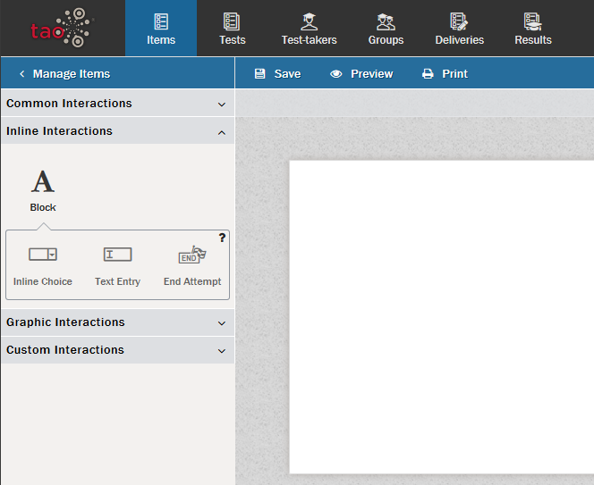

# Interactions: An Overview

> [Interactions](../appendix/glossary.md#interaction) are the basic building blocks for [Items](../appendix/glossary.md#item), which in turn are the basic building blocks for [Tests](../appendix/glossary.md#test). For a full definition, see [What is an Interaction?](../interactions/what-is-an-interaction.md).

This section provides an overview of how to manage your interactions, including their creation, what to put in an interaction, viewing them, and their use once created.

## Using different kinds of interactions

**[Common Interactions](../appendix/glossary.md#common-interaction)** cover many of the simple interactions that are often used in assessment. In TAO, the following Common Interactions can be used in the creation of assessment items:

- [Choice Interaction](../interactions/choice-interaction)
- [Order Interaction](../interactions/order-interaction)
- [Associate Interaction](../interactions/associate-interaction)
- [Match Interaction](../interactions/match-interaction)
- [Hottext Interaction](../interactions/hottext-interaction)
- [Gap Match Interaction](../interactions/gap match-interaction)
- [Slider Interaction](../interactions/slider-interaction)
- [Extended Text Interaction](../interactions/extended-text-interaction)
- [File Upload Interaction](../interactions/file-upload-interaction)

**[Inline Interactions](../appendix/glossary.md#inline-interaction)** are interactions which contain text-based elements. In TAO, the following Inline Interactions can be used in the creation of test items:

- [Inline Choice Interaction](../interactions/inline-choice-interaction)
- [Text Entry Interaction](../interactions/text-entry-interaction)
- [End Attempt](../interactions/end-attempt)

**[Graphic Interactions](../appendix/glossary.md#graphic-interaction)** elements. In TAO, the following Graphic Interactions can be used in the creation of test items:

- [Hotspot Interaction](../interactions/hotspot-interaction)
- [Graphic Order Interaction](../interactions/graphic-order-interaction)
- [Graphic Associate Interaction](../interactions/graphic-associate-interaction)
- [Graphic Gap Interaction](../interactions/graphic-gap-interaction)
- [Select Point Interaction](../interactions/select-point-interaction)

**[Portable Custom Interactions (PCI)](../appendix/glossary.md#custom-interaction)** are interactions which are developed for a specific scenario, mostly to fulfill a specific need of a customer.

## Creating New Interactions

New interactions are created as part of items in a test. With the exception of PCIs (which are project-specific),
each of the above interactions is described in detail in its own section of the User Guide. 
