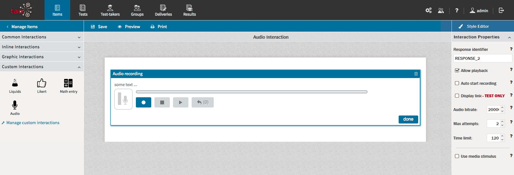
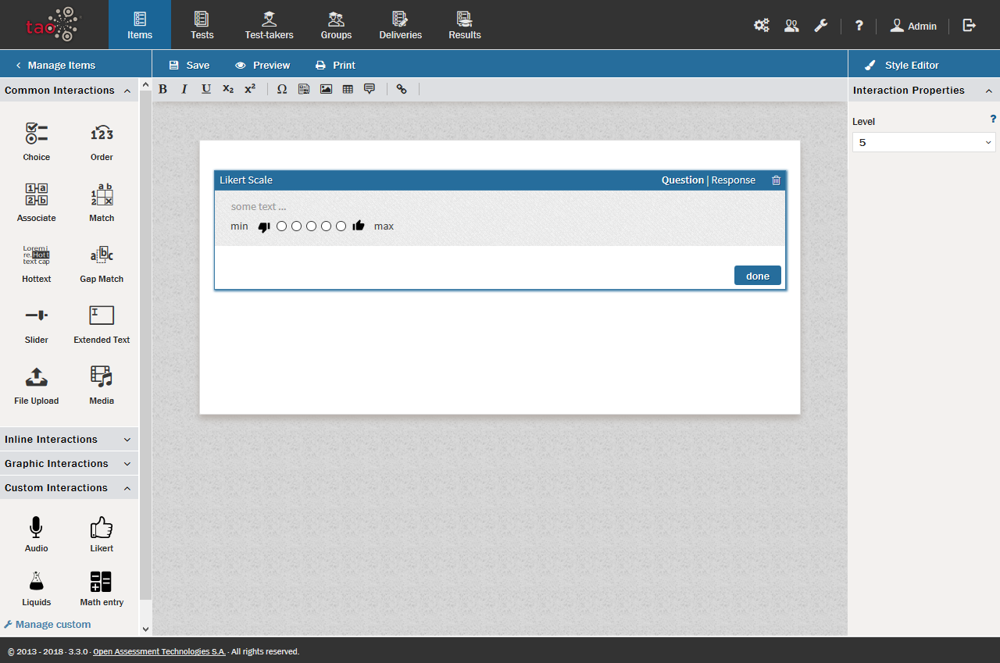
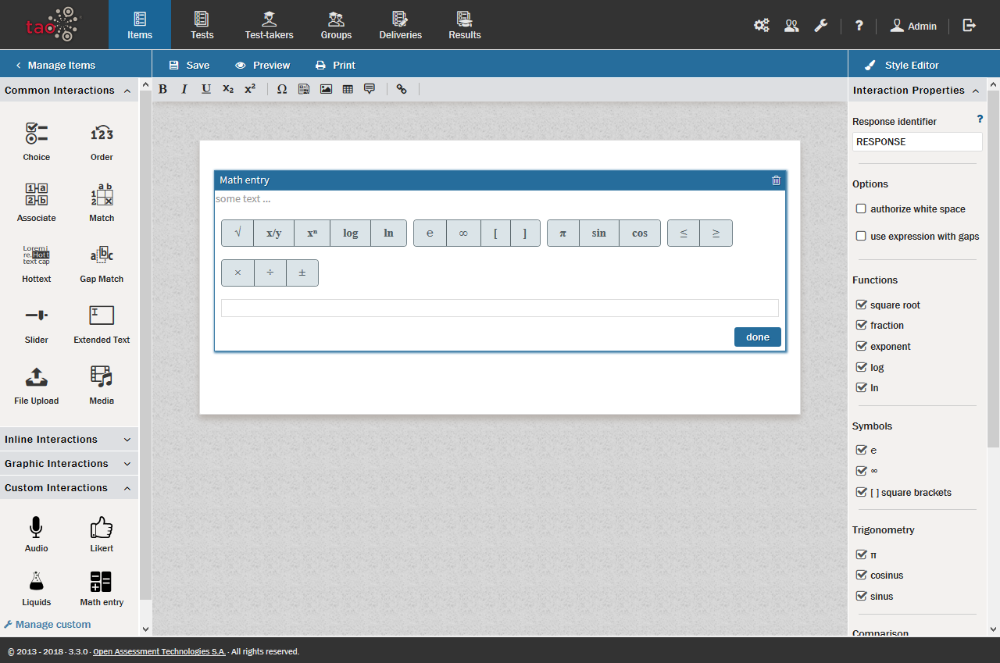

<!--
tags: []

-->

# PC Interactions

>Portable Custom Interactions (PCIs) are [Interactions](../appendix/glossary.md#interaction) which are developed for a specific scenario, generally to fulfill a particular need of a customer, hence are not classical QTI interactions. PCIs represent a best practice for defining and packaging custom interactions. Unlike classical [Custom Interactions](../appendix/glossary.md#custom-interaction), they interact with the test runner (standardized APIs), allowing them to be ported from one system to another.

The following types of PCI are part of the standard TAO package: *Audio, Likert, Liquid, Text Reader*, and *Math Entry*.
 

- **Audio**: An *Audio* interaction enables the [Test-taker](../appendix/glossary.md#test-taker) to record a short spoken response, typically to test his/her speaking ability. The test-taker is presented with an image of a tape recorder, and can record speech by clicking on the record button, and check the recording using the play-back button. The response format is an audio file. Audio interactions are only compatible with *Firefox* and *Chrome*, not with *Internet Explorer* or *Edge*. *Chrome* requires a connection via *https*, whereas at the present time *Firefox* allows both *https* and *http* connections (this is, however, expected to change to only *https* in the future).

- **Likert**: In a *Likert* interaction, a scale from 1-5 is used to represent people's attitudes to a topic. This is commonly used in qualitative surveys. The scale is presented using 'thumbs-down' and 'thumbs-up' images to represent a negative or positive response, and offers five buttons from which to select a choice. The response is a simple integer representing the selected choice. Likert interactions are not usually scored, as there is no right or wrong.

- **Liquid**: A *Liquid* interaction, developed to showcase the possibilities of PCIs, contains a simple simulation of a liquid container. The container has a scale on the left-hand side. This type of interaction can be used to ask questions about volume. To record the correct answer, click on *Response* and then click inside the cube at the desired point. If the answer is "5 liters", for example, click in the cube at the level of the 5 on the scale on the left-hand side, and the cube will 'fill' to that level with a simulated blue liquid.

- **Text reader**: A *Text Reader* interaction provides a space for a simple reading passage, and offers the possibility of scrolling and paging. *Note: See the section on [Interaction Authoring Tools](../interactions/interaction-authoring-tools.md) for details on text editing options such as using italics or bold text in your test reader item, and inserting features such as shared stimuli or media, tables or formulae.*

<!-- Missing Screenshot: Text Reader Interaction -->

- **Math Entry**: A *Math Entry* Interaction employs a Math Editor, which allows for the use of mathematical symbols in the interaction. The editor provides a list of mathematical symbols and an empty text field. Please note that the editor only provides the possibility of drawing mathematical symbols, but does not carry out any calculation. See the [Math Expressions section](../items/math-expressions.md) for more information on how to use the Math Editor.

**1.** To create any of these types of interaction, once you have created a new Item, click on the [Custom Interactions library](../appendix/glossary.md#custom-interactions-library) below *Graphic Interactions* on the left, and drag the appropriate interaction type onto the blank Item, drop it onto the [canvas](../appendix/glossary.md#canvas), and then populate the Item.
