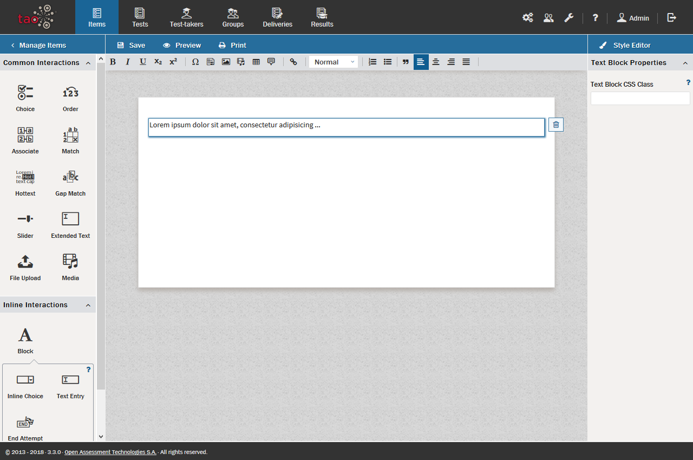

# Text Blocks

>[Text Blocks](../appendix/glossary.md#text-block) are used to create [Inline Interactions](../appendix/glossary.md#inline-interactions). A text block is basically a paragraph, and forms a framework into which one of the two available text-based inline interactions (Inline Choice, Text Entry) is then inserted.

> Text Blocks are represented by the icon  in the [Interactions Library](../appendix/glossary.md#interactions-library) on the left, under [Inline Interactions](../appendix/glossary.md#inline-interactions).

   
**1.** Using Text Blocks with Inline interactions

After you have created a new [Item](../appendix/glossary.md#item), drag a *Text Block*   from the [Inline Interactions Library](../appendix/glossary.md#inline-interactions-library) below *Common Interactions* on the left, onto the blank item and drop it onto the [Canvas](../appendix/glossary.md#canvas).

This creates a field (containing a sample text) in which a text may be entered from a favorite source (you can copy and paste text from any text editor, or website, for instance), or typed in.

To enter your text, click inside the text field.

*Note: See the section on [Interaction Authoring Tools](../interactions/interaction-authoring-tools.md) for details on text editing options such as using italics or bold text in your item, and inserting features such as shared stimuli or media, tables or formulae.*

For more detail on how to create the two inline interactions which use *Text Blocks*, see the sections on [Inline Choice Interaction](../interactions/inline-choice-interaction.md) and [Text Entry Interaction](../interactions/text-entry-interaction.md).
