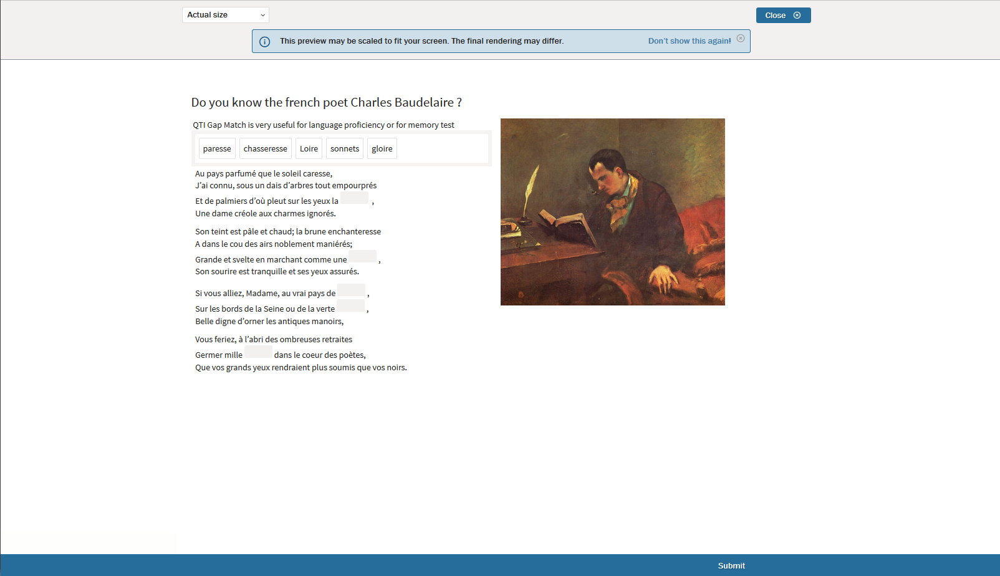

# What is an Interaction?

*"Interactions allow the candidate to interact with the item. Through an interaction, the candidate selects or constructs a response. The candidate's responses are stored in the response variables. Each interaction is associated with (at least) one response variable."* - Question and Test Interoperability standard, published by IMS Global

[Interactions](../appendix/glossary.md#interaction) serve as the basic unit for [Test-taker](../appendix/glossary.md#test-taker) responses. Items may be made up of one or several related interactions. As such, the term *Interaction* should not be considered interchangeable with the term [Item](../items/what-is-an-item.md). 

There are four categories of Interactions: common, inline, graphic, and custom or PCI. There are currently 17 interactions recognized by the QTI standard.

In TAO, interactions include the mechanisms used to score the interaction itself. 

For simple Items, correct answers add to the [Test](../appendix/glossary.md#test) score, unlike incorrect answers. Scoring a composite item using standard response templates (*match correct*, *map response*, or *map response point*) are often a more complicated sum.

__Note: Identifiers which can be configured in Interactions need to contain only ASCII characters due to QTI restrictions. ASCII character replacements can be found at sites such as [Oracle](https://docs.oracle.com/cd/E29584_01/webhelp/mdex_basicDev/src/rbdv_chars_mapping.html) and [ASCII Code](https://www.ascii-code.com/).__
