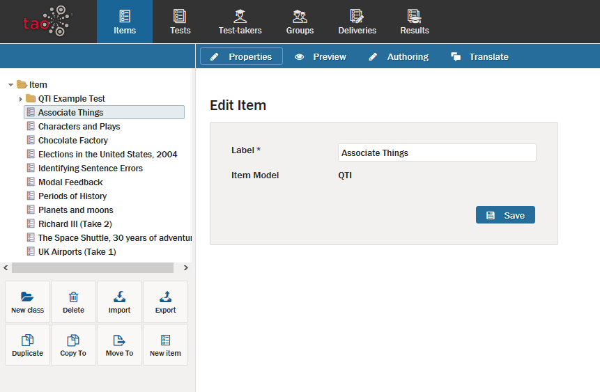
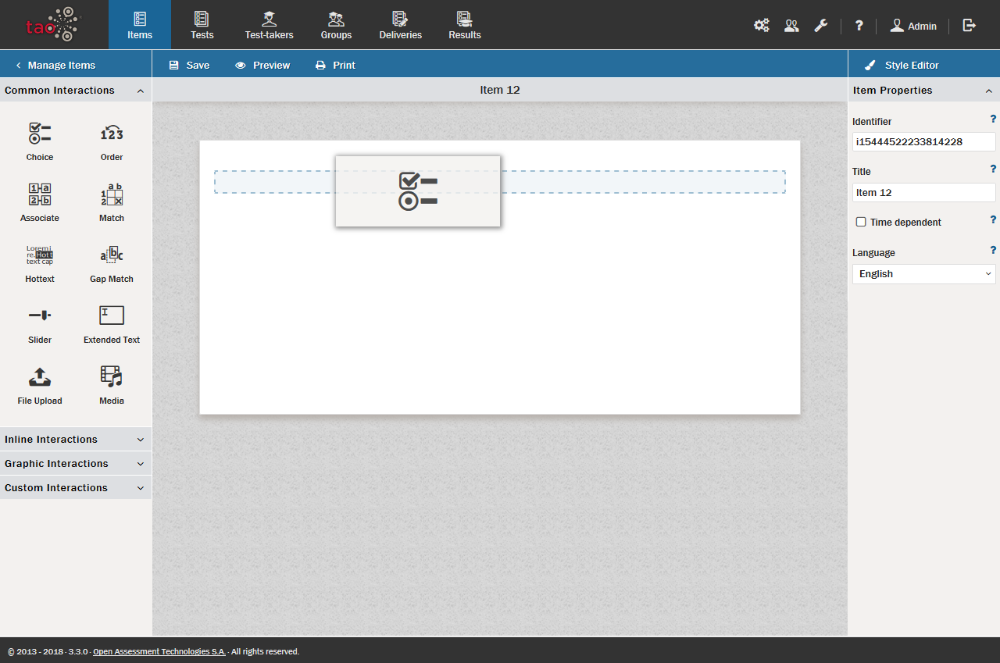
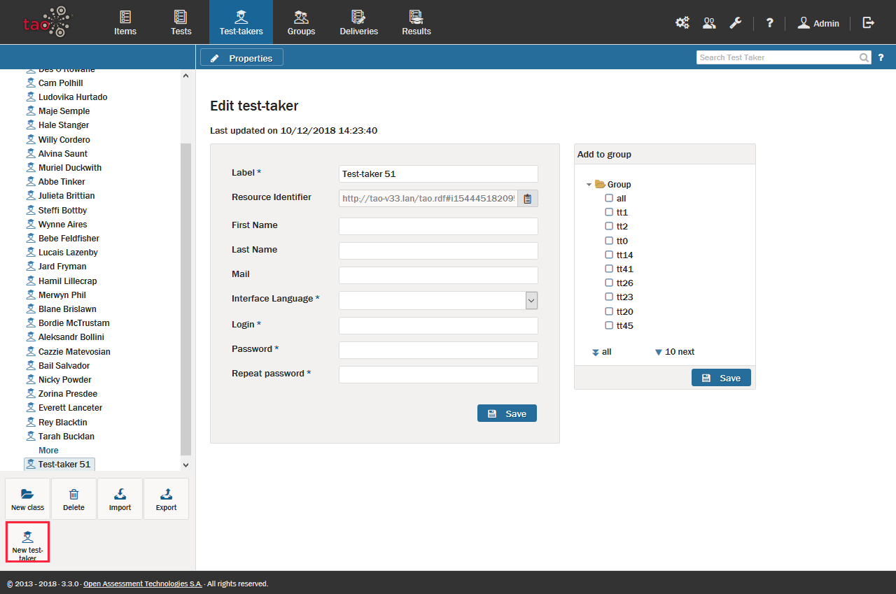
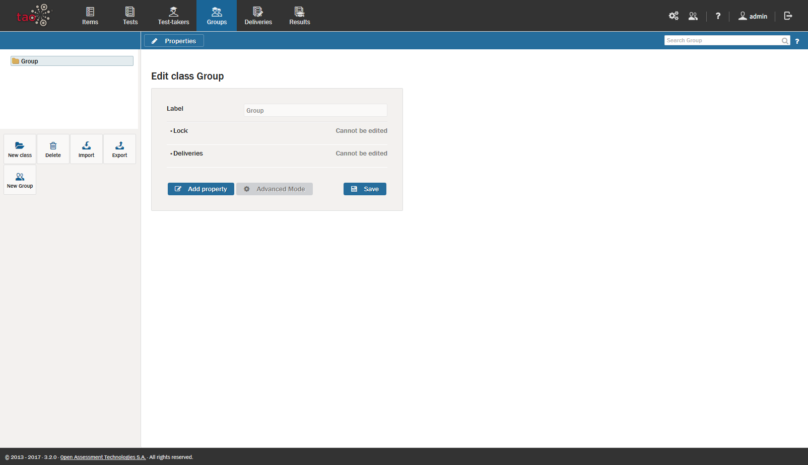
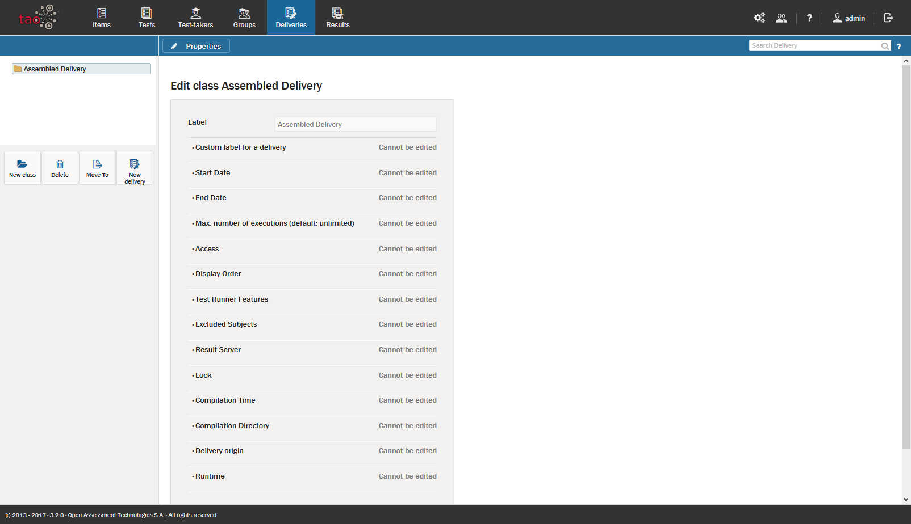

# Take a Tour

>This section takes you on a short tour of TAO, giving you an overview of how to prepare and organize your assessments using TAO.

**Why use TAO?** 

TAO helps you set up and organize all types of assessments quickly and efficiently. TAO's simple architecture allows for the easy navigation of resources which enables you to re-use existing tests or parts of tests. You can also add new assessment material to previous assessments, including those used by other teachers or with other groups.

**Putting an Assessment together**

An assessment in TAO consists of several different building blocks: [Interactions](../appendix/glossary.md#interaction), [Items](../appendix/glossary.md#item) and [Tests](../appendix/glossary.md#test).

An *interaction* is the most basic unit in an assessment, and takes the form of a question (e.g. multiple choice), or other task type (e.g fill-in-the-blank). An *item* is a set of interactions to be used together, along with any supporting material, and a *test* is a group of items, together with information on how they are ordered and presented to the test-taker.

Let's walk through the steps needed to create an assessment and manage your assessment resources.

**1.** Check what test items are already available.

Test items prepared by other users may be available to you, as well as items you have prepared yourself for previous assessments.

In TAO's [Assessment Builder Bar](../appendix/glossary.md#assessment-builder-bar), select the _Items_  icon and examine the test items that are already available in the Library on the left.

If you do not have enough ready-to-go items, then you will need to create new ones utilizing TAO's item authoring tool.

**2.** Create items.

The Items page consists of three parts. On the left is the [Library](../appendix/glossary.md#library), where you can view the inventory of already existing items. In the center is the [Canvas](../appendix/glossary.md#canvas), where you can provide a label for a new Item and then author it, or edit the label, author or preview an exiting Item. And when you are _Authoring_ an item, the [Properties Panel](../appendix/glossary.md#properties-panel) will appear on the right, where you can select component settings for your items, interactions, and tests, such as your chosen scoring method. This three-part layout is a common feature of the TAO system. 

To create a new Item, you would select the _New Item_  icon on the bottom of the left panel. See the [Creating a new item section](../items/creating-a-new-item.md) for more details.

**3.** Add interactions to your item.

Your new item will consist of *interactions* which are added by _Authoring_ an item. Interactions include the following types: [Common](../appendix/glossary.md#common-interaction), [Inline](../appendix/glossary.md#inline-interaction), [Graphic](../appendix/glossary.md#graphic-interaction), and [Custom Interactions](../appendix/glossary.md#custom-interaction). For further information on these types, see the [Interactions section](../interactions/what-is-an-interaction.md).

For each type, the procedure to create interactions will vary. See detailed descriptions of these procedures in each Interaction section.

**4.** Use your items in a test.

Once you have populated your item with interactions, you will need to build it into a test before you can use it in an assessment. A test can include one or more items. 

To do this, select the _Tests_  icon  on the assessment builder bar. You can add items to a test by selecting them from the Test Library. See the [Creating a new test section](../tests/creating-a-new-test.md) for more details.

**5.** Give your test a trial run.

You can try your test by setting up a test-taker account. A trial helps ensure everything will run as expected during the actual student assessment. After checking the Test with a trial run, the next step is to set up a Delivery.

**6.** Register Your [Test-takers](../appendix/glossary.md#test-taker).

Students need to be registered as Test-takers in TAO before the first assessment. In most cases, this is done by the instructor or course administrator using student rosters. 

To do this, select the _Test-takers_  icon in the Assessment Builder Bar. See the [Creating test-takers section](../test-takers/creating-test-taker.md) for more details.

**7.** Assign test-takers to [Groups](../appendix/glossary.md#group).

After entering or uploading the [Test-taker profiles](../test-takers/creating-test-taker.md) of all your students in TAO, you will need to organize them into groups depending on which students are taking which assessments. It may be that an entire class of students is taking the same assessments, or it may be that you need to create smaller groups of test-takers for certain types of assessment.

To do this, select the _Groups_  icon in the assessment builder bar. See the [Creating a new group section](../groups/creating-a-new-group.md) for more details.

**8.** Publish and deliver your test

Before students can take the assessment you have prepared, the test needs to be assembled as a [Delivery](../appendix/glossary.md#delivery). 

Assembled deliveries govern when a test will be taken, which selected individuals or groups will take the test, and how long the test will last. They only take a few moments to put together.

To do this, you will need to select the _Deliveries_  icon in the assessment builder bar. See the [Creating a new delivery section](../deliveries/create-a-new-delivery.md) for more details.

**9.** View Your [Results](../appendix/glossary.md#results).

After the assessment is over, you will want to see how your test-takers did. 

To do this, select Results in the assessment builder bar.
See the [Viewing results section](../results/viewing-results.md) for more details.

