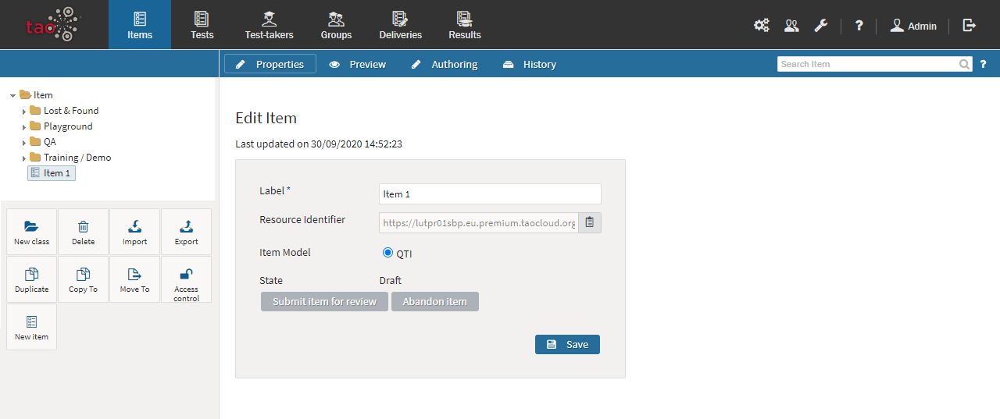
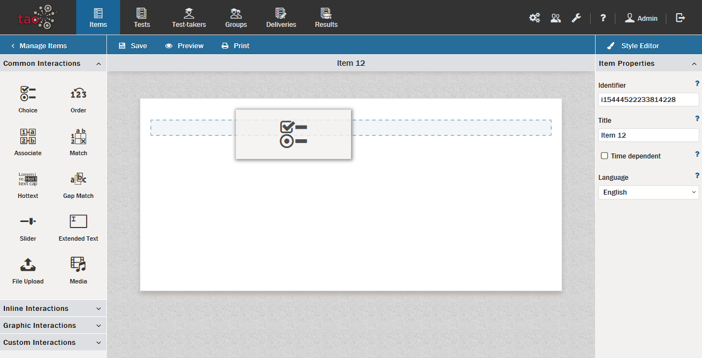
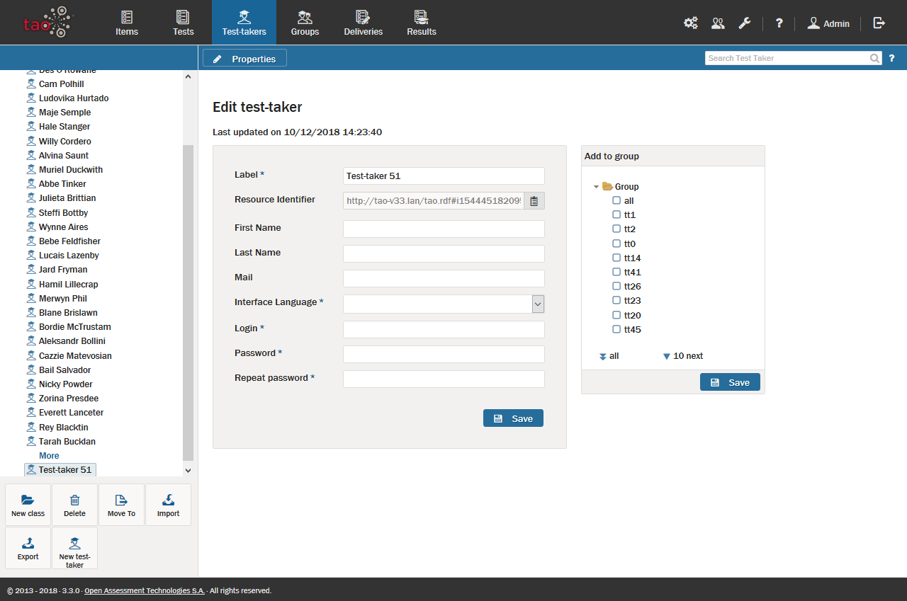
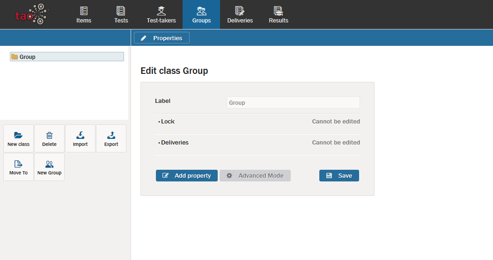
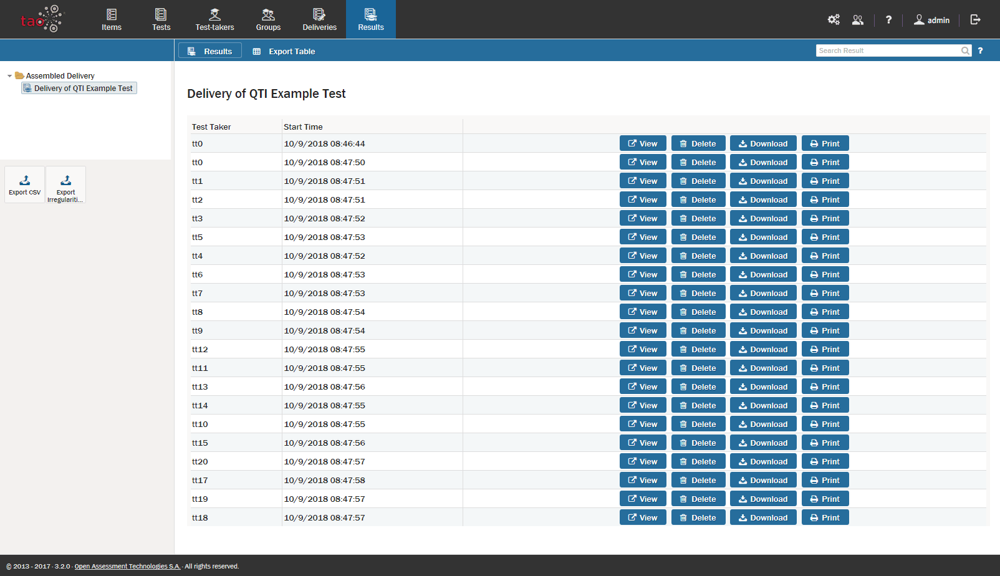

<!--
created_at: 2016-12-15
authors:         
    - "Catherine Pease"
--> 

# Take a Tour

>This section takes you on a short tour of TAO, giving you an overview of how to prepare and organize your assessments using TAO. There are links to the relevant sections of the User Guide which will give you more detailed information on how to set up your own assessments once you start working with TAO.

**Why use TAO?** 

TAO helps you set up and organize all types of assessments quickly and efficiently. TAO's simple architecture allows for easy resource navigation, enabling you to re-use existing tests or parts of tests, and to add new assessment material to previous assessments, including those used by other teachers or with other groups.

**Putting an Assessment together**

An assessment in TAO consists of several different building blocks: [Interactions](../appendix/glossary.md#interaction), [Items](../appendix/glossary.md#item) and [Tests](../appendix/glossary.md#test).

An *interaction* is the most basic unit in an assessment, and takes the form of a question (e.g. multiple choice), or other task type (e.g fill-in-the-blank). An *item* is a set of interactions to be used together, along with any supporting material, and a *test* is a group of items, together with information on how they are ordered and presented to the test-taker.

Now, let's walk through the steps of create an assessment and manage your assessment resources.

**1.** Check what test items are already available.

Test items prepared by other users may be available to you, as well as items you have prepared yourself for previous assessments.

In TAO's [Assessment Builder Bar](../appendix/glossary.md#assessment-builder-bar), select Items and examine the test items that are already available in the Library on the left.

If you do not have enough ready-to-go items, then you will need to create new ones. TAO offers a solution with intuitively designed testing Item templates.

**2.** Create items.

TAO has plenty of easy-to-use [Item Templates](../items/creating-a-new-item.md) to work with. To create a new item, click the Items icon in the assessment builder bar.

This opens the Items page, which consists of three parts. On the left is the [Library](../appendix/glossary.md#library), where you can view the inventory of already existing items. On the right is the [Properties Panel](../appendix/glossary.md#properties-panel), which you will use to select component settings for your items, interactions, and tests, such as your chosen scoring method. In the center is the [Canvas](../appendix/glossary.md#canvas), where item authoring takes place.

This three-part layout is a common feature of the TAO system. See the [Creating a new item section](../items/creating-a-new-item.md) for more details.

**3.** Add interactions to your item.

Your new item will consist of *interactions*. Authoring an item means adding interactions to it. Interactions include the following types: simple, text-based, graphic, and miscellaneous (called [Common Interactions](../appendix/glossary.md#common-interaction), [Inline Interactions](../appendix/glossary.md#inline-interaction), [Graphic Interactions](../appendix/glossary.md#graphic-interaction), and [Custom Interactions](../appendix/glossary.md#custom-interaction) in TAO). For further information on these types, see the [Interactions section](../interactions/what-is-an-interaction.md).

For each type, the procedure to create interactions will vary. See detailed descriptions of these procedures in each Interaction section.

**4.** Use your items in a test.

Once you have populated your item with interactions, you will need to build it into a test before you can use it in an assessment. A test can include one or more items. 

To do this, go back to TAO's assessment builder bar, and select tests. You can add items to a test by selecting them from the Test Library. See the [Creating a new test section](../tests/creating-a-new-test.md) for more details.

**5.** Give your test a trial run.

This can be done by setting up a dummy test-taker account, which you would do at the start of the academic year. A trial helps ensure everything will run as expected during the actual student assessment. After checking the Test with a trial run, the next step is to set up a Delivery.

**6.** Register Your [Test-takers](../appendix/glossary.md#test-taker).

Students need to be registered as Test-takers in TAO before the first assessment. In most cases this is done by the instructor or course administrator using student rosters. 

To do this, select Test-takers in the Assessment Builder Bar. See the [Creating test-takers section](../test-takers/creating-test-taker.md) for more details.

**7.** Assign test-takers to [Groups](../appendix/glossary.md#group).

After entering or uploading the [Test-taker profiles](../test-takers/creating-test-taker.md) of all your students in the TAO assessment system, you will need to organize them into groups, depending on which students are taking which assessments. It may be that an entire class of students is taking the same assessments, or it may be that you need to create smaller groups of test-takers for certain types of assessment.

To do this, select groups in the assessment builder bar. See the [Creating a new group section](../groups/creating-a-new-group.md) for more details.

**8.** Publish and deliver your test

Before students can take the assessment you have prepared, the test needs to be assembled as a [Delivery](../appendix/glossary.md#delivery). 

Assembled deliveries only take a few moments to put together, and govern when a test will be taken, which selected individuals or groups will take the test, and how long the test will last. 

To do this, you will need to select Deliveries in the assessment builder bar. See the [Creating a new delivery section](../deliveries/create-a-new-delivery.md) for more details.

**9.** View Your [Results](../appendix/glossary.md#results).

After the assessment is over, you will want to see how your test-takers did. 

To do this, select results in the assessment builder bar.
See the [Viewing results section](../results/viewing-results.md) for more details.

