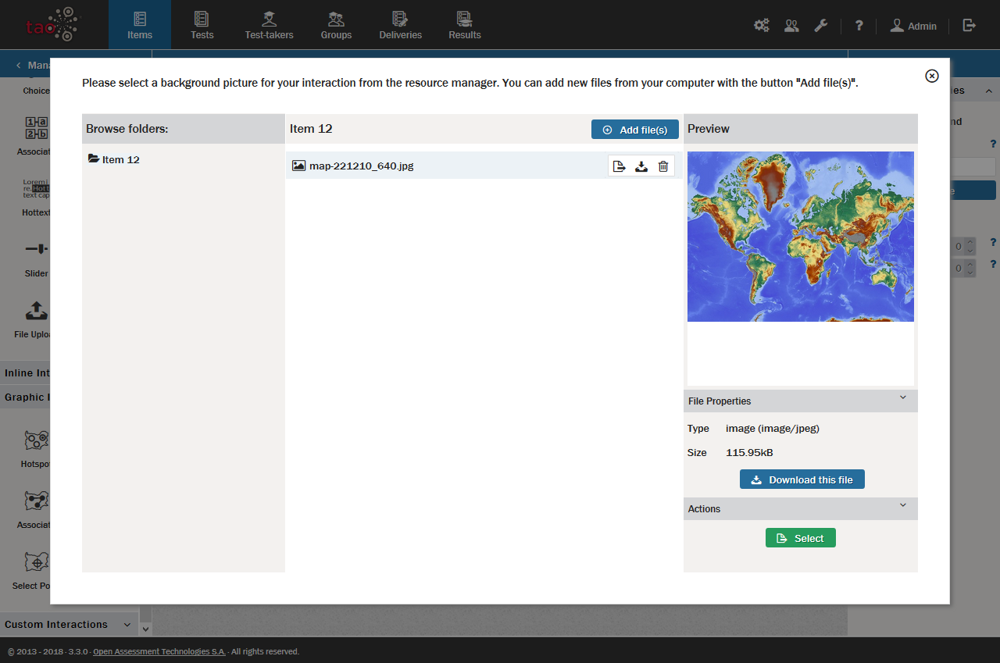

# Adding Media

> Items and interaction can contain media, e.g. images, videos or sound files. For instructions on how to add Media (videos or sound files), refer to the Media interaction section. This section describes how to add still images to a typical text block.

**1.** Whenever a text block is selected in your [Interaction](../appendix/glossary.md#interaction) or [Item](../appendix/glossary.md#item) (e.g. the choices in a choice interaction) a tool bar appears in the grey bar above the item. 

Two of the icons allow you to insert either images  or other media . This tutorial focusses on the image, but the workflow for other media is almost identical.

**2.** Click on the image icon.

This opens a window which provides access to the [Resource Manager](../appendix/glossary.md#resource-manager), and consists of three panels. As with the main window, the left panel is a [Library](../appendix/glossary.md#library): the Resource Library. The middle panel shows the list of pictures which are available within the highlighted [Class](../appendix/glossary.md#class) in the resource library. The right panel provides a preview and properties. If your picture is already in the resource library, click on that picture and skip to Step 4. If it is not, then carry out Step 3.

**3.** To add a new image from your desktop, click the blue *Add file(s)* button. Then, click the blue *Browse...* button.

You can now navigate your computer system to select the still image you wish to upload into your TAO system. Then click on the green *Upload* button. When it has been uploaded, a preview image of the graphic will appear. You can select any _.jpg_, _.gif_, or _.png_ graphic file to upload and display. 

**4.** Click the green *Select* button.

This uploads your still image into the text block. If you begin typing without hitting return, the text will center vertically. If your text extends beyond the first line, however, it will wrap underneath the image. If the image is followed by a longer text, it is best to click on return on your keyboard at least once before starting to type.
