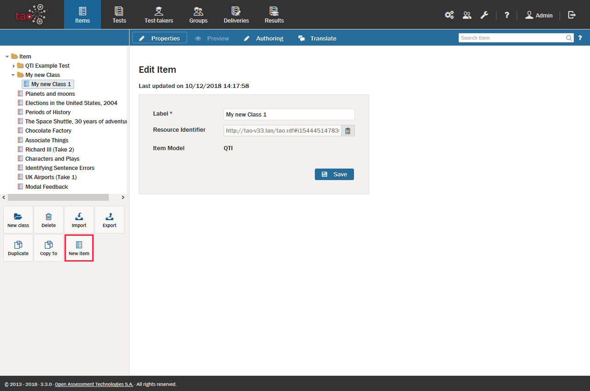

# Creating a New Item

>Together, questions and other types of [Interaction](../appendix/glossary.md#interaction) form [Items](../appendix/glossary.md#item), which comprise parts of [Tests](../appendix/glossary.md#test). Items are created and populated with interactions, and can be combined to assess [Test-taker](../appendix/glossary.md#test-taker) performance.

>There are more than 17 types of interaction in TAO. Note that an item generally contains only one interaction type.

Now, let's walk through the steps of creating an item.

**1.**  Click on the _Items_  icon in the [Assessment Builder Bar](../appendix/glossary.md#assessment-builder-bar).

This will take you to the Items page. The [Library](../appendix/glossary.md#library) on the left-hand side will show existing items. The last item to be edited (either by you or a previous user) will be highlighted in the library. In this tour, however, you will create a new item.

**2.**  Click on the *New item*  icon in the button bank under the library.

This will create a new item in the selected folder.

*Note: To create a new item in a different folder, click on that folder in the library, and then select the New item icon in the button bank. To create a new folder (in TAO these represent classes), click on New class in the button bank. Select a location within the library, and the new folder (class) will be created there.*

*Note: The 'Access control' button (in the picture this is in the button bank under the library on the left) is only available if the extension taoDacSimple is installed.*

**3.**  Label and save your item.

Creating a new item will bring up a new dialog box with the option to name (or label) your item. After labeling your item, click *Save*. This produces an empty item, which you can now populate with interactions.

**4.**  Click on the _Authoring_  icon in the [Action Bar](../appendix/glossary.md#action-bar).

This will take you to the empty item you have created. You can now start to fill this with your interactions. In the library on the left, you will see the [Common Interactions](../appendix/glossary.md#common-interactions) catalog. You will find the other types of interaction below this catalog: [Inline Interactions](../appendix/glossary.md#inline-interactions), [Graphic Interactions](../appendix/glossary.md#graphic-interactions) and [Custom Interactions](../appendix/glossary.md#custom-interactions). You can navigate these catalogs to choose the types of interaction you want to use for your item. The [Interactions](../interactions/what-is-an-interaction.md) section will tell you about the different types of interaction which you can use in TAO.

You can create an item which contains more than one interaction. Once you have added and prepared one interaction in your item, drag another interaction template from the [Interactions Library](../appendix/glossary.md#interactions-library) onto the [Canvas](../appendix/glossary.md#canvas) below or beside the interaction you have just authored, and repeat the authoring process for the new interaction. 

You can preview your item to see how it will appear to the test-taker. For information on this, see [Previewing Items and Interactions](../items/preview.md).

**5.** Select the settings for your item. 

Two settings can be chosen for your new item in the [Item Properties](../appendix/glossary.md#item-properties) to the right of the canvas.

**Time dependent:** Check the *[Time dependent](../appendix/glossary.md#time-dependent-item)* box if you wish the length of time a test-taker takes to complete the item to be recorded. This information will be used when the response is processed.  

**Language:** Select the language of your item from the drop-down menu. This will be used for the [Text-to-Speech](../appendix/glossary.md#test-to-speech) functionality. The default language is English.

<aside class="optional-extras">

## Optional Extras

### Duplicating an existing item

You can make a copy of an already existing item by clicking on the *Duplicate*  icon in the button bank under the library. A duplicate will then be created in the folder of the item you have duplicated, with the same name but with "bis" on the end.

### Copying or moving an existing item

You can make a copy of an already existing item by clicking on the *Copy To*   icon in the button bank under the library. 

A dialog box will appear on the canvas. Select a destination folder, and click on *Copy*. A copy of the item will then be created in the folder you have selected, with the same name but with "bis" on the end.

*Move To*  works in exactly the same fashion.

</aside>
