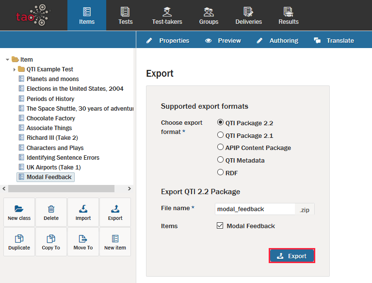

# Exporting Items

> Sometimes it is necessary to export your items from TAO either for sharing or backing them up. Here you will walk through the process.

Interactions can be put together into Items on almost any computer that has access to TAO. However, there will be situations in which sharing Items will be useful. For instance, two teachers who teach the same course may collaborate and share the responsibility of creating questions for an upcoming Test. This can be done in a few easy steps.

**1.**  Click on the [Items](../appendix/glossary.md#item)  icon in the [Assessment Builder Bar](../appendix/glossary.md#assessment-builder-bar).

**2.**  Click either on a Class  or an Item symbol  in the Item [Library](../appendix/glossary.md#library) on the left-hand side to select one or multiple items.

**3.**  After the selection, click *Export*  in the button bank below the library.

The dialog box will ask you to choose an export format from the list: _QTI_, _APIP_ or _RDF_. If the Item is to be exported as a Question and Test Interoperability (QTI) formatted document, it will save the file(s) as a compressed _.zip_ file.

You also need to confirm that the folder or file highlighted is the one that should be exported, by checking the *Items* box.

**4.**  Click the blue *Export* button in the dialog box to continue with the export.

**5.**  Select the location to which you want to export your item, and then click *Save*.

The item can then be transferred either to a data storage device or a computer network. The next step in the transfer is [to import the item onto the desired computer](../items/importing-items.md).
