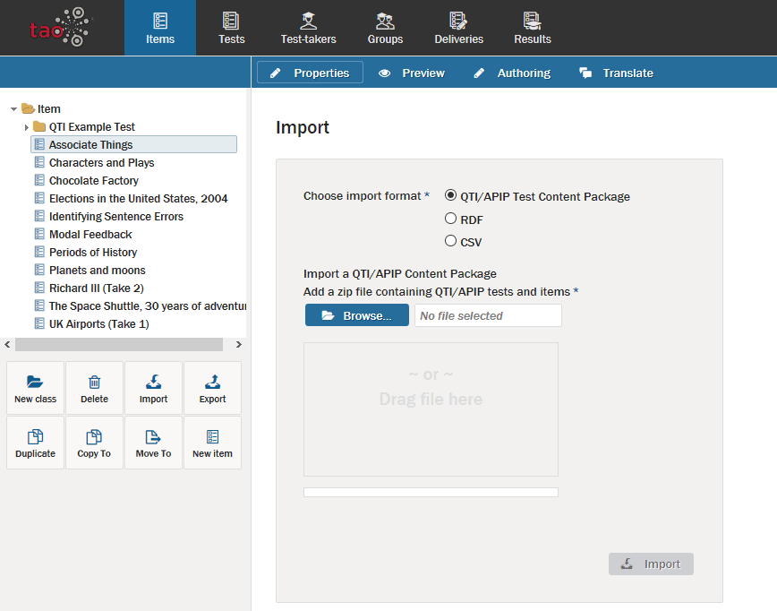

<!--
created_at: 2016-12-15
authors:         
    - "Catherine Pease"
--> 

# Importing Items

> [Items](../appendix/glossary.md#item) and [Interactions](../appendix/glossary.md#interaction) can be imported from one computer to another, using an operation called *Import*.

**1.**  Click on *Items*  on the [Assessment Builder Bar](../appendix/glossary.md#assessment-builder-bar).

This will take you to the [Item Library](../appendix/glossary.md#library), which you will see on the left.

**2.**  Click on the Item folder  in the library in which you wish to import the new item.

**3.**  Click on *Import*  in the button bank below the library.

This opens a dialog box which asks you to select the format of the item to be imported. The supported input formats are: _QTI (Question and Test Interoperability)_ packages or items, _APIP (Accessible Portable Item Protocol)_ packages, _RDF (Resource Description Framework)_ or _CSV (Comma-Separated Values)_ files. Be sure that the Item to be imported is in this format, or the import won't work. 

**4.** Click the blue *Browse* button to find the file intended for import (alternatively, the file may be dragged and dropped into the box below the button).

**5.**  Once the item is selected, click on the blue *Import* button.

This will import the item into the Item library, after which it can be added to [Tests](../appendix/glossary.md#test), or modified.
