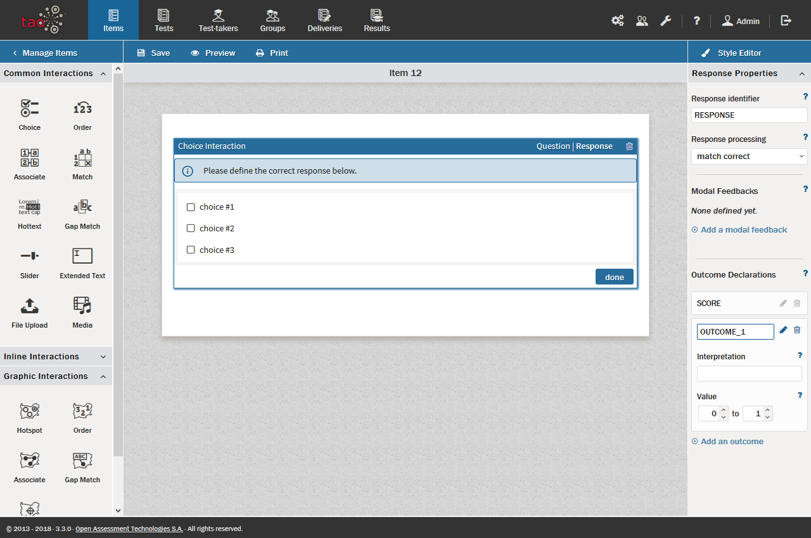

<!--
created_at: 2016-12-15
authors:         
    - "Catherine Pease"
--> 

# Item Scoring Rules

>Item scores are determined by the student's performance in the various [Interactions](../appendix/glossary.md#interaction) which make up the [Items](../appendix/glossary.md#item) of which the [Test](../appendix/glossary.md#test) is composed. Interactions generate individual scores which count towards the overall score of the Item. These individual scores can be tallied in different ways. This chapter shows how to configure these.

>For information on Test Scoring Rules, see [Test Scoring Rules and Outcome Declarations](../tests/scoring-and-outcome-declarations.md).

After you have created your interaction, go to the *Response* window and follow the steps below to set up your chosen scoring method.

**1.** In the [Response Properties panel](../appendix/glossary.md#response-properties-panel) on the right, locate the *Response Processing* pull-down choice box offering the two options: *Match Correct* and *Map Response*.

*Match Correct:* With this processing option, either the question is answered correctly or incorrectly. There is no partial credit, so if part of the response is incorrect, the whole answer is marked as incorrect.

*Map Response:* With this processing option, it is possible to give partial credit for a response. This is useful for questions where the answer is given in multiple parts. With the *map response* option, some parts of the answer can also be weighted more heavily than other parts if you consider them to be of higher importance.

**2.** Select the *Response Processing* type which is appropriate for the question.

This is going to depend to a large extent on preference, particularly with respect to partial credit.

If you select *Match Correct*, stop here - the scoring settings for this interaction are complete.

**3.** If you select *Map Response*, review the responses in your interaction, then determine and assign corresponding weights to each potential response.

Partial credit can be awarded here by assigning values in the weight boxes in order of importance in your Interaction canvas.
 
*Note: For most interaction types, score boxes are located to the right of the potential responses.*

**4.** Set the values of the *Score Range* fields, located in the Response Properties panel.

This is where you can specify the minimum and maximum number of points awarded for this interaction. Its use is optional.

The minimum score indicates the minimum number of responses the [Test-taker](../appendix/glossary.md#test-taker) is required to select for it to be a valid answer. If the interaction involves selecting more than one response, the maximum  score should reflect the total of the weights for all correct responses, i.e. the maximum score possible for your Interaction. If only one response is expected, the maximum should equal that of the highest weight. Adjust these values as needed.

So if, for example, there are two correct responses in the question, and you have assigned a weight of 1 to one of them, and a weight of 2 to the other, the Test-taker would get a score of 3 if they are both correct (providing the maximum is set to 3 or above).

Other values in the *Score Range* field include *Mapping Default*, which contains the default value given if no specific scores are assigned to a response, and the check box used to *Define Correct Response*. The latter should be checked if there are specific correct responses, and left unchecked if the correctness of the answer is dependent on the sum of weights accumulated by the Test-taker in answering the interaction.

Lastly, it should be noted that TAO assigns a *Response Identifier* to each interaction response. It is best not to change this.
