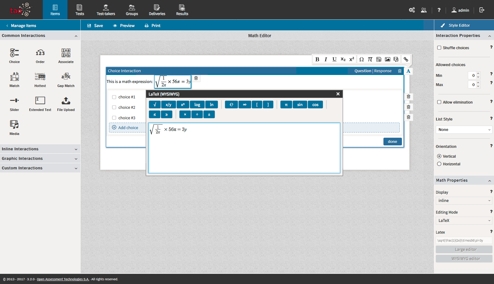

<!--
created_at: 2017-08-30
authors:         
    - "Catherine Pease"
--> 

# Math Expressions

>[Math Expressions](../appendix/glossary.md#math-expression) (i.e. mathematical operators), or formulae, can be employed in [Interactions](../appendix/glossary.md#interaction) by using the [Formula Editor](../appendix/glossary.md#formula-editor). The *Formula Editor* is a WYSIWYG editor based on MathQuill (http://mathquill.com/), which allows you to use mathematical symbols to create LaTeX expressions containing mathematical operators. It is found in the Custom Interactions section.

To access the Formula Editor follow the steps below.

**1.**  Once you have created a new [Item](../appendix/glossary.md#item), click on the [Custom Interactions Library](../appendix/glossary.md#custom-interactions-library) below [Graphic Interactions](../appendix/glossary.md#graphic-interaction) on the left, and drag the *Math Entry* icon onto the blank item and drop it onto the [Canvas](../appendix/glossary.md#canvas).

The MathQuill editor can also be accessed from any block by selecting *Insert Math Expression* (the *pi* symbol) and then clicking on the *WYSIWYG editor*.

A list of mathematical symbols will appear, with an empty text field below.

**2.** Click on the mathematical symbols you wish to use.

These will appear in the text field. They can then be used in the writing of mathematical formulae, such as questions on geometry.

*Note: The Formula Editor only provides the possibility of drawing mathematical symbols, but does not carry out any calculation.*

