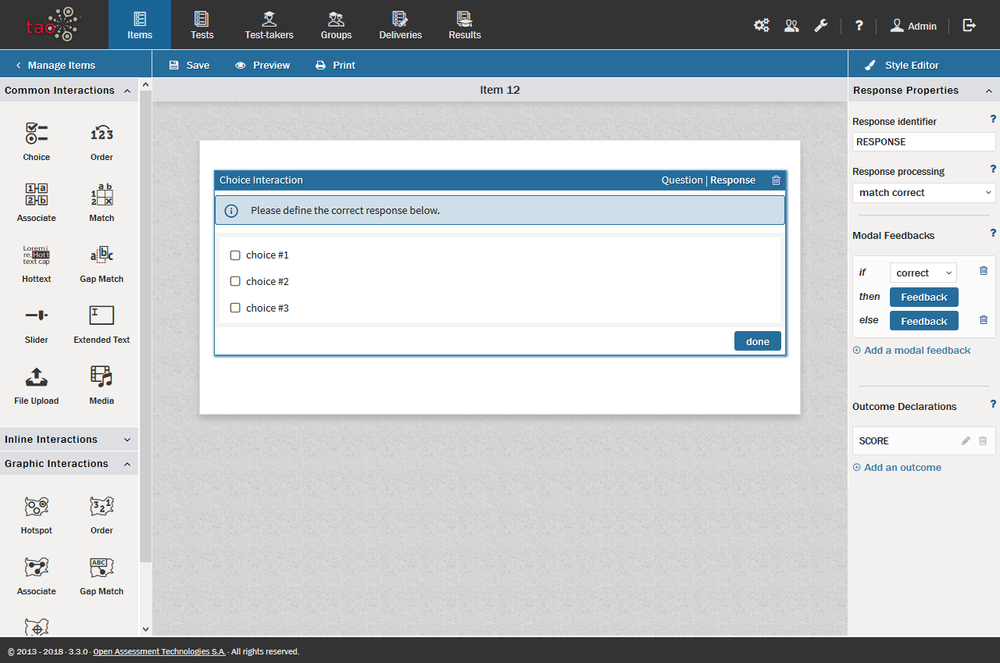

<!--
created_at: 2016-12-15
authors:         
    - "Catherine Pease"
--> 

# Modal Feedback

>Modal feedback can be defined as a message presented to the [Test-taker](../appendix/glossary.md#test-taker) outside of the [Item](../appendix/glossary.md#item), when the test-taker selects an answer. Feedback may be triggered by either a correct or an incorrect answer, depending on the conditions set by the test author. 

After you have created your [Interaction](../appendix/glossary.md#interaction), go to the *Response* window and follow the steps below if you would like the test-takers to receive modal feedback during this interaction.

**1.** Many of the interaction types have the option of giving *Modal Feedback*. If this is available, click on the *Add a Modal Feedback* button in the [Response Properties Panel](../appendix/glossary.md#response-properties-panel) on the right.

This opens a modal feedback panel in which you can insert the feedback and specify when it should be given.

**2.** Insert your feedback and feedback conditions.

If the feedback is to be given when the test-taker gets the correct answer, then ensure that the *if*-statement is set to *correct*. You can also set it to *incorrect* or any numeric comparative relationship. 

Then fill in the *then*-statement by first clicking on the blue *Feedback* button, and then entering the desired text in the pop-up window. When complete, click the *done* button.

If alternative feedback for the opposite condition is required, click the *Feedback* button for the *else*-statement, and follow the same procedure used to set up the initial feedback.

**3.** If additional modal feedback is required, then click the *Add a Modal Feedback* button below your first Modal Feedback and repeat the above steps.

You can preview your modal feedback using the steps given in the [Preview instructions](../items/preview.md).
