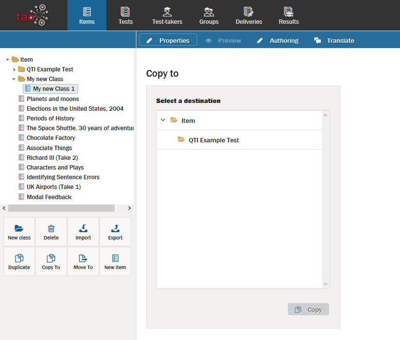

# Moving or copying items

>Items can me moved or copied within the same library

In any library inside TAO you can move elements to a different folder by dragging and dropping them to the new destination. This does not only apply to items but also to tests, test-takers etc. You can copy elements by duplicating and moving them to a different directory. This is, however, limited to desktop environments.

The buttons *Copy To* and *Move To* allow you to do this in a different, platform independant way. 

**1.**  Click on the *Copy To*  or *Move To*  icon in the button bank under the library.

This will show the dialog below:

**2.**  Select the new directory and click on *Copy* or *Move* at the bottom of the dialog depending on your original action.
