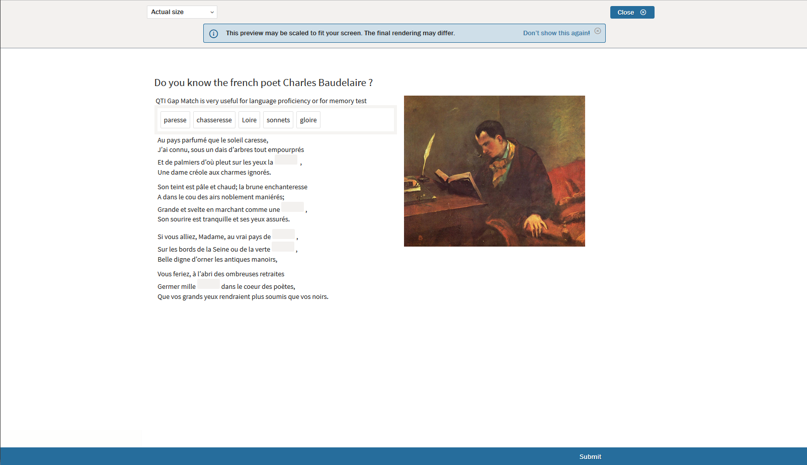

# Previewing Items and Interactions

> Completed [Items](../appendix/glossary.md#item) or [Interactions](../appendix/glossary.md#interaction) can be previewed to determine how they appear to the test-taker, and what they look like on various screen sizes.

**1.** Preview your interaction or item.

To preview your interaction or item, click on the *Preview* button in the [Action Bar](../appendix/glossary.md#action-bar) above the [Canvas](../appendix/glossary.md#canvas).
 
A pop-up window will appear with which you can save your interaction (the window will appear whether the interaction has been saved already or not, just to ensure that the latest version of the Interaction is not lost during testing).

**2.** Click the blue *Save* button in the pop-up window.

This brings up the Interaction as it will appear to the [Test-taker](../appendix/glossary.md#test-taker).

Answer the question correctly or incorrectly to see if the interaction performs as expected. Clicking *Submit* will bring up a black screen below the demonstrated interaction which shows the score for the answer you have given.

If the interaction uses *Map Response* scoring, it is a good idea to try out not only answers which are either completely correct or completely incorrect, but also to test the various ways in which partial credit may be awarded.

**3.** Once testing is completed, click the *Close* button at the top of the page.

This will take you back to the point where further changes to the interaction may be made (click on the item to return to *Authoring*), or where the Interaction can be dismissed until the test is assembled.
