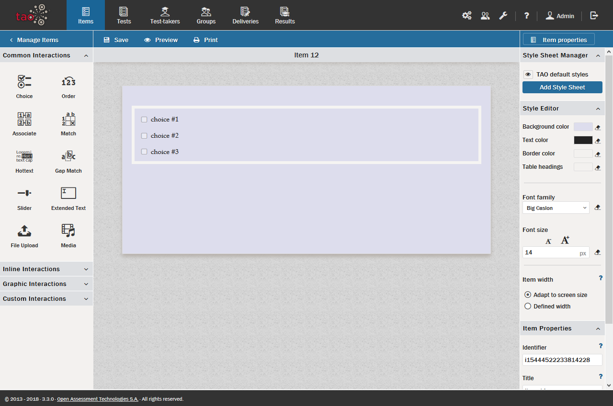

<!--
created_at: 2016-12-15
authors:         
    - "Catherine Pease"
--> 

# Style Editor

>White, black, grey, and blue, all done up in a sans-serif font, can get boring after a while. The *Style Editor* can help you make your items look more appealing. The Style Editor is found in the TAO interface above the [Properties Panel](../appendix/glossary.md#properties-panel) on the right in an [Item](../appendix/glossary.md#item) window. It should be noted that this feature is meant only to adjust the appearance of a small number of items. If you are dealing with larger item banks, you may want get in touch with us to discuss the otions for a customized version of TAO.

**1.**  To access the Style Editor, click on the *Style Editor* button in the blue [Action Bar](../appendix/glossary.md#action-bar) above the Properties Panel.

This will turn the Properties Panel into a Style Editor panel. There are two parts to the editor, the *Style Sheet Manager* at the top, and the *Style Editor* below this.

**2.** If you have a style sheet ready for upload, click on the *Add Style Sheet* button. 

This will provide an interface similar to that of adding a graphic into a [Graphic Interaction](../appendix/glossary.md#graphic-interaction). You can use an existing style sheet by clicking the *Add file(s)* button and uploading it. 

In all other cases, if you wish to format the style for this item only, use the Style Editor below to enter the settings you would like to use for this item. The style editor has three parts: (1) Color, (2) Font, and (3) Item width.

**3.** Adjust the colors to your liking.

There are four color swatches that can be changed in accordance with your preferences, one for each of: Background color, Text color, Border color, and Table headings.

Clicking on any of these (e.g. *Background color*) opens a color editor panel which consists of a square surrounded by a color wheel (a swatch), and a text box below. 

Select a color by moving the cross onto the desired hue on the color wheel. In the square you can then adjust the contrast (left and right) and brightness (up and down). You can use the text box to save a specific color setting when it is found as portions of Red, Green, Blue (in RGB hexidecimal-percent of primary color density).

The four swatches cover specific parts of any item and its [Interactions](../appendix/glossary.md#interaction). The Background color provides the color backing of the entire item. The text color is used for all text within the item and its related interactions. The border color governs that of the borders of interactions. Finally, the table heading color swatch provides the color setting for interactions which use tables (such as Match).

**4.** Adjust the fonts to your liking.

Create the desired font by adjusting the *font family* and *font size*. 

Click on the Font Family box, and select a font family besides Default. 

There are three types of fonts available: San Serif fonts - lacking extra strokes at the ends of letters, Serif fonts - with the small, projecting strokes at the ends of letter, and Monospace fonts - resembling a typewriter, each letter being of equal width. 

Using fonts which are not on this list requires setting up a style sheet.

To select a font size, click in the *font size* box and type in a number.  There is no limit to the size of font that can be selected, but of course if the font is set too large it won't be displayed properly.

**5.** The item width can be set in the *Item width* box.

The default item width is set to adapt to the width of the user's screen. It is highly recommended that you do not change this setting.

Some institutions prefer students to take [Tests](../appendix/glossary.md#test) only on specifically designated computers which have a specific screen width. TAO ofers the option to set the width for a given item. However, for most schools, setting a width presents a significant disadvantage in that a set width setting that doesn't adapt to screen size means different-sized computer screens may have problems displaying Items. If it is unnecessary to specify the item width, it is best to use the default setting.

**6.** If you are not satisfied with any of the settings you've selected, click on the *Eraser* icon on the right of any of the settings boxes, and the item will be restored to its default setting.

This is particularly useful if the settings selected for the item render an indecipherable result. Simply restore the default settings with a click.

