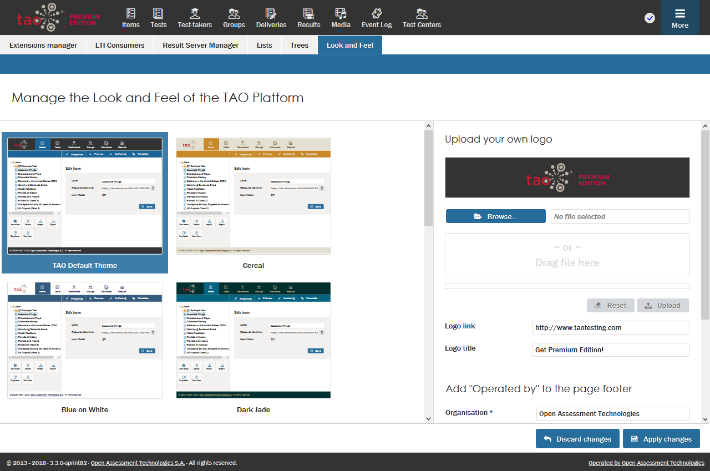

<!--
created_at: 2018-11-05
authors:         
    - "Catherine Pease"
--> 

# Customization in TAO

>You can make the environment your own by customising your TAO installation and adding your own branding to the TAO product, so that it is recognizable to your [Test-takers](../appendix/glossary.md#test-taker) and other users.

**Follow the steps below to customize your TAO environment and add your own branding:** 

Hover over the Settings icon (depicted by three cogs) located on the right-hand side of the [Assessment Builder Bar](../appendix/glossary.md#assessment-builder-bar), and click on the *Look and Feel* tab.

**1.** Select a look and feel for your environment.

The color scheme options for the background to your TAO environment will appear on the screen. 

In the default theme for the TAO environment, the assessment builder bar is black, the [Action Bar](../appendix/glossary.md#action-bar) is blue, and the background is white, but there are nine other color scheme options to choose from.

Click on the screen of your choice to set the desired look and feel of TAO.

**2.** Upload your company's logo. 

Having your company or organization's own logo on your TAO environment makes the environment your own.

Select your logo file using the blue *Browse* button, or drag and drop the file from your hard drive. 

Next, add a title, and the link which you would like to be activated. When a user clicks on your logo, the linked URL will open in a new window. 

Now add the information *Operated by* to the page footer. You can add your organization or company's name, and an email address, in the boxes.

If you are happy with the information you have entered, click on  *Apply changes* to save it. If not, click on *Discard changes*.

Your institution or company may also want to provide direct access to the TAO environment from its own website. As a subscriber to the Premium Edition of TAO, your organization can set up a shortcut to the TAO environment via a URL which you own, to refer users directly to TAO. 

