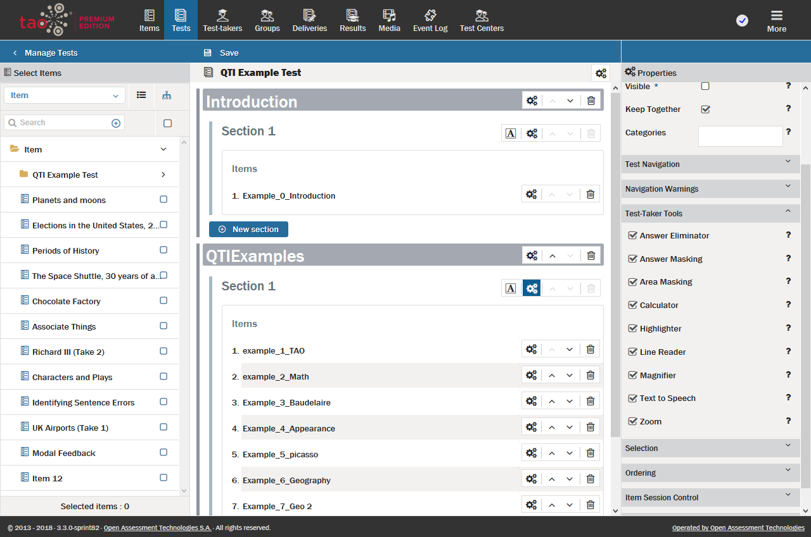

<!--
created_at: 2018-10-02
authors:         
    - "Catherine Pease"
-->

# Enabling Text-to-Speech

>In the Premium edition of TAO, [Tests](../appendix/glossary.md#test) can be configured to provide [Test-takers](../appendix/glossary.md#test-taker) with the option of hearing the test content as well as reading it.

The text-to-speech functionality allows the test-taker to hear the test questions, or parts of them, read aloud. It is configured on the [Section](../appendix/glossary.md#section) and [Item](../appendix/glossary.md#item) levels of a test.

To carry out the steps below to activate this functionality for your test: 

After [creating a new Test](../tests/creating-a-new-test.md), configure the [Properties](../appendix/glossary.md#properties) for each section or item for which you wish to activate the test-to-speech functionality. 

Click on the appropriate properties icon (depicted as three interacting cogs) for the relevant section/item. The *Section* level properties icon can be found on the right of each section. The *Item* level properties icon can be found on the right of each item.

The properties will appear in the [Properties Panel](../appendix/glossary.md#properties-panel) on the right.

Open the drop-down menu [Test-taker Tools](../appendix/glossary.md#test-taker-tools) and check the *Text to Speech* box at the bottom. 

The text-to-speech functionality is now enabled, and will be available to test-takers for the relevant sections or items of your test.

