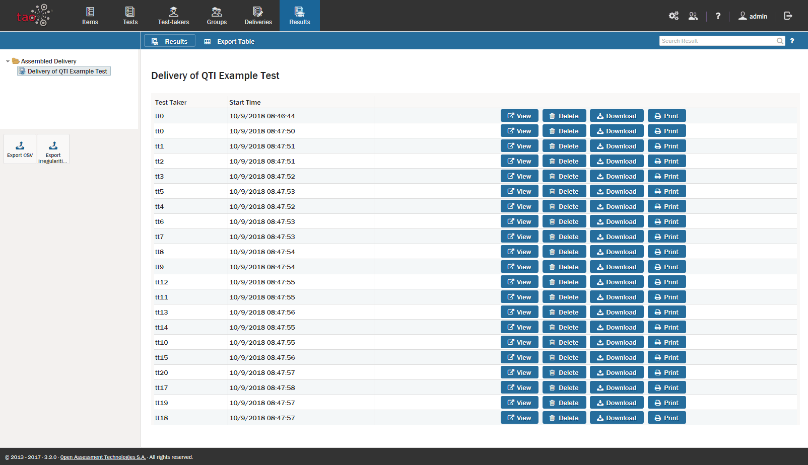

<!--
created_at: 2016-12-15
authors:         
    - "Catherine Pease"
--> 

# Results: An Overview

>The [Results](../appendix/glossary.md#results) of [assessments](../appendix/glossary.md#test) are collected for each assessment [Delivery](../appendix/glossary.md#delivery).

This section provides an overview of how to manage the Results of your Tests, including how to view the results and how to export them to a different device.

**1.** Viewing Results

The [Results tables](../appendix/glossary.md#results-table) associated with each Delivery are stored in the library and the results for any [test-taker](../appendix/glossary.md#test-taker) can be viewed. For information on how to do this, see the section on [Viewing Results](../results/viewing-results.md).

**2.** Exporting Results

There will be situations in which posting Results on another system will be useful. Exporting Results Tables can be done in a few easy steps. For information on how to do this, see the section on [Exporting Results](../results/exporting-results.md).
