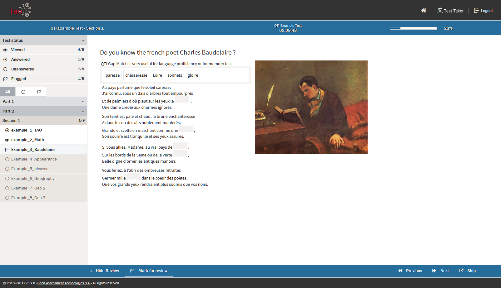

<!--
created_at: 2018-10-30
authors:         
    - "Catherine Pease"
-->

# Review Panel

>A Review Panel can be made available to [Test-takers](../appendix/glossary.md#test-taker), in which they can see their progress through a particular [Test](../appendix/glossary.md#test).

When you move to the first question of a test, the review panel, if activated by the [Test Author](../appendix/glossary.md#test-author), will automatically appear on the left. 

The review panel is divided into two parts: the first section shows information about the general *Test Status*, and the second section gives more detailed information on the different [Test-parts](../appendix/glossary.md#test-part). 

In *Test Status* the following general statistics are given about the your progress:

**Viewed:** In the *Viewed* box, you can see how many screens form the test, and how many of them they have already viewed.  

**Answered:** Here, you can see how many questions there are in the test, and how many you have answered.

**Unanswered:** You can see here how many of the questions in the test you have *not* answered

**Flagged:** The number of questions which have been flagged for later review will be shown in this box. See the section on [Test-taker Tools](../taking-a-test/test-taker-tools.md) for more information on flagging. 

In the second section, the test content for each Test-part is broken down by [Interaction](../appendix/glossary.md#interaction), and organized into types, so that you can see a more detailed overview of your progress. 

By selecting the corresponding icon at the top of the second section, you can choose to display all interactions, only the interactions you have not yet answered, or only the interactions which have been flagged for review.

