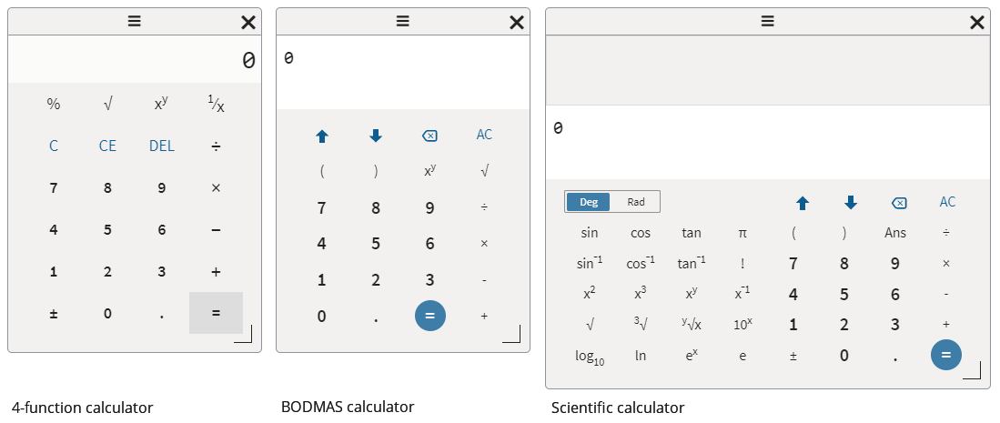
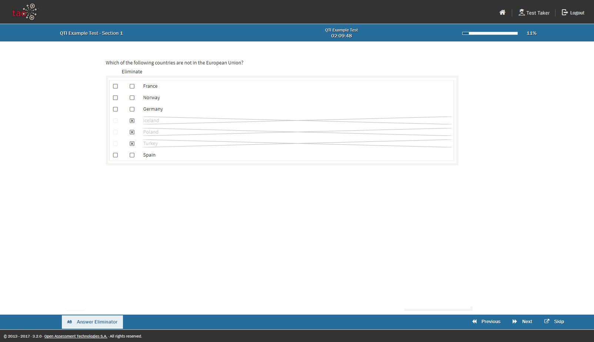
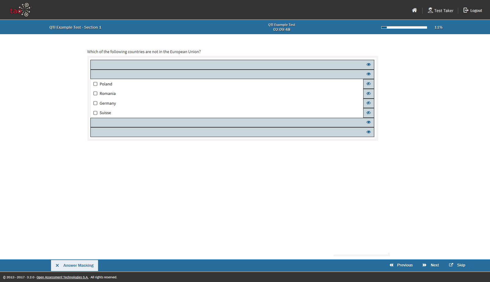
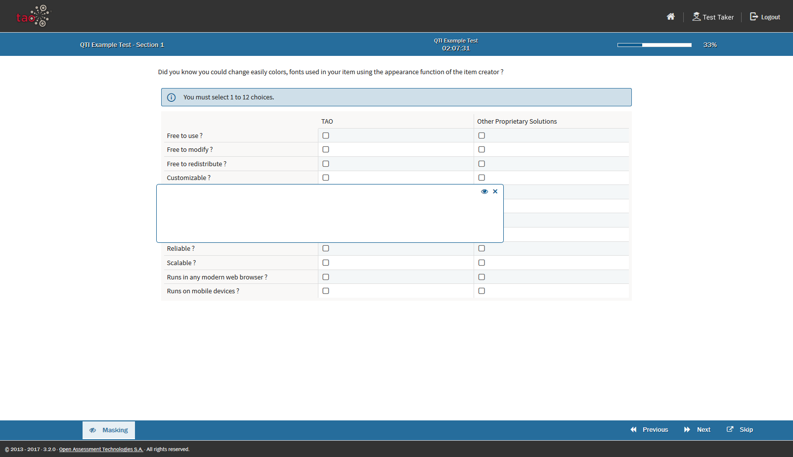
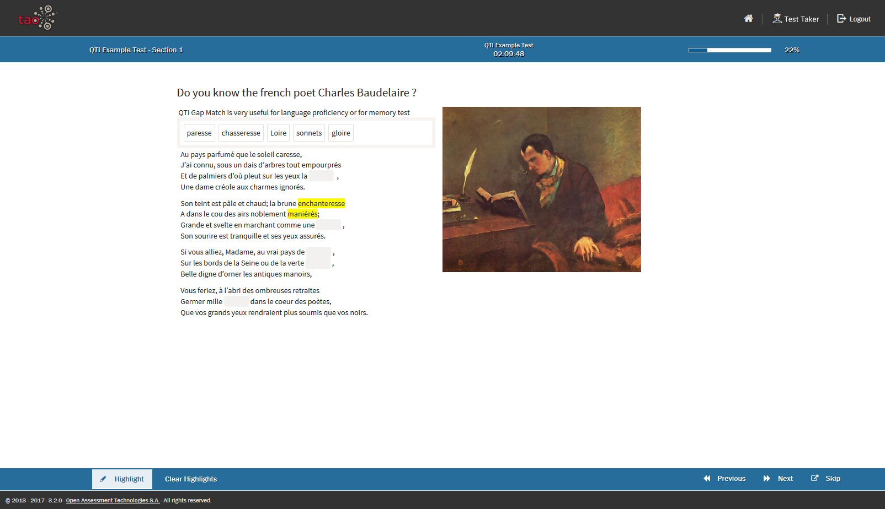
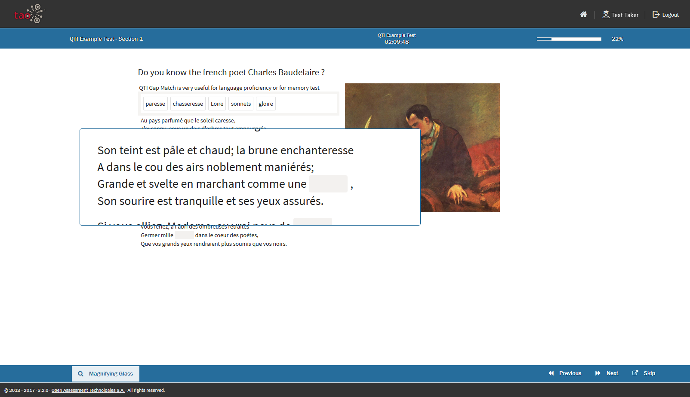
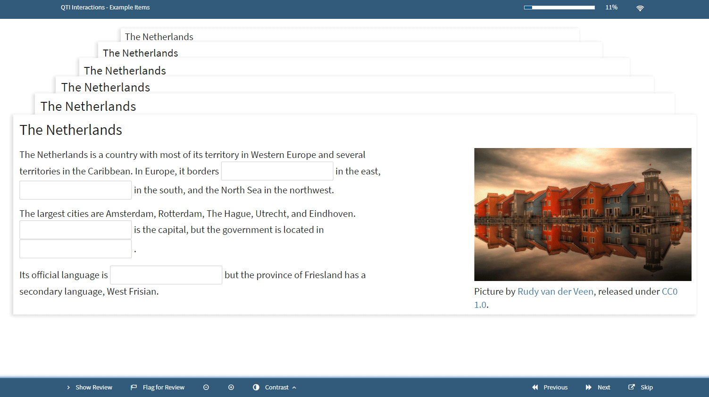
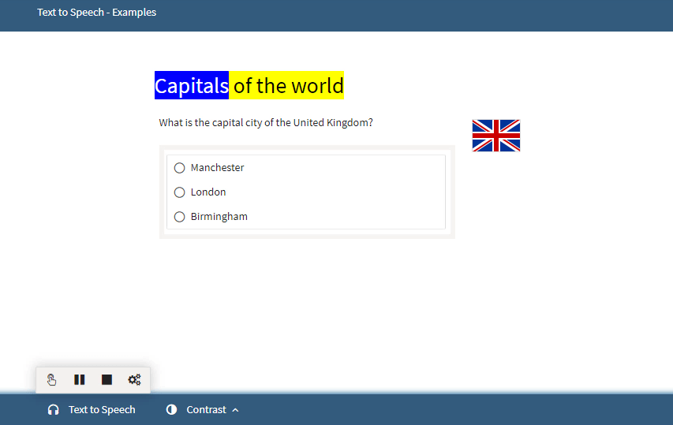
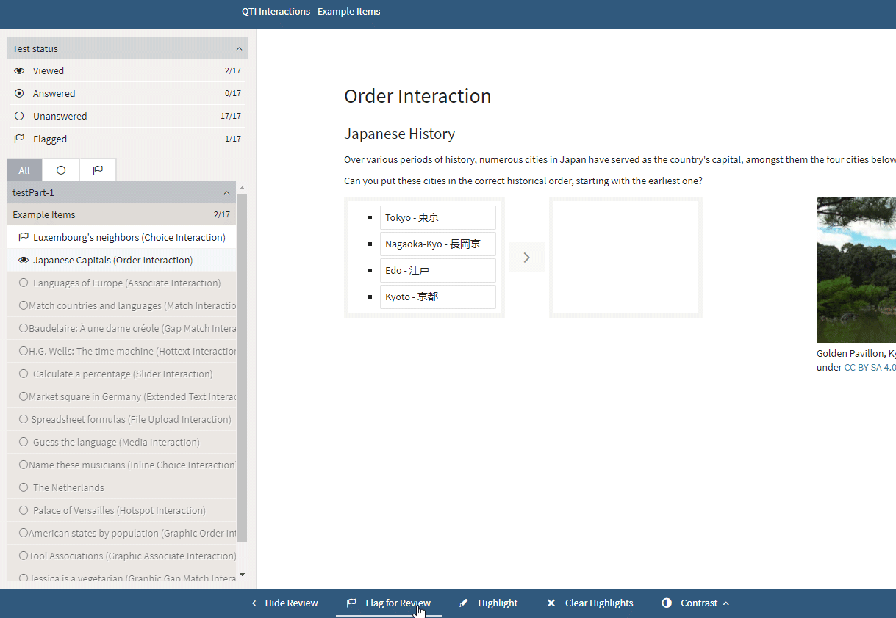

# Test-taker Tools

> The [Test-taker Tools](../appendix/glossary.md#test-taker-tools) are a set of accommodation tools which are designed to aid the [Test-taker](../appendix/glossary.md#test-taker) in various ways when taking tests. 

The Test-taker Tools which have been activated for a [Test](../appendix/glossary.md#test) can be found in the [Properties Panel](../appendix/glossary.md#properties-panel) on the right.

*Note: Test-taker tools can be activated either for a whole [Section](../appendix/glossary.md#section) of a test, or for each [Item](../appendix/glossary.md#item). Not all Test-taker Tools are activated for every test - this depends on the test configuration.*

The tools available can be divided into the following groups:

## Calculators

There are three different types of calculator available: 

**Simple Calculator**
This option provides you with a basic calculator.

**BODMAS Calculator**
This option provides you with a calculator which functions according to the BODMAS rule.

**Scientific Calculator**
This option provides you with a calculator for solving science, engineering and mathematical problems.

## Visual Aids

This set of tools can help you to focus visually on a particular part of the test question in various different ways:

**Answer Eliminator**
The Answer Eliminator allows you to eliminate answers in *Choice* interactions. This is useful if there is a long list of answer choices, and the test-taker has a learning disability.

**Answer Masking**
Answer Masking allows you to mask and unmask answers in choice interactions.

**Area Masking**
Area Masking allows you to mask parts of the item with a movable mask.

**Highlighter**
The Highlighter allows you to highlight parts of the text in an item.

**Line Reader**
The Line Reader allows you to visually isolate a line of text.

**Magnifier**
The Magnifier provides you with a movable magnifier tool.

**Zoom Tool**
The Zoom Tool allows you to zoom in on an area of an item.

## Aural Aids
**Text-to-speech Tool** 
The text-to-speech functionality allows you to hear the questions of a test being read aloud. *Note: This functionality is only available in the Ignite/Premium Edition of TAO.*

For more information on how the text-to-speech function works, see [Text-to-speech](../taking-a-test/text-to-speech.md).

## Reminders
**Flag**
Flagging an answer to a particular question allows you to review the answer at a later stage. Flagged items are marked in the review panel on the left. The test-taker can return to flagged items by clicking on the flag in the review panel.

## Check Time and Connectivity
**Time Limits**
If a time limit has been set for a test, the time you have left will be shown in the middle of the bar across the top of the screen once the test has been started. You can choose to hide this if you wish, by clicking on the timer next to the time display.

**Connection Indicator**
When you begin a test, a connection indicator in the form of a connectivity icon will appear on the left-hand side of the blue bar across the top. You can check connectivity by hovering over it: if your computer is connected to the internet, the message *Connected to Server* will appear.

A list of keyboard shortcuts for these tools can be found in the section [Keyboard Shortcuts](../taking-a-test/keyboard-shortcuts.md).
