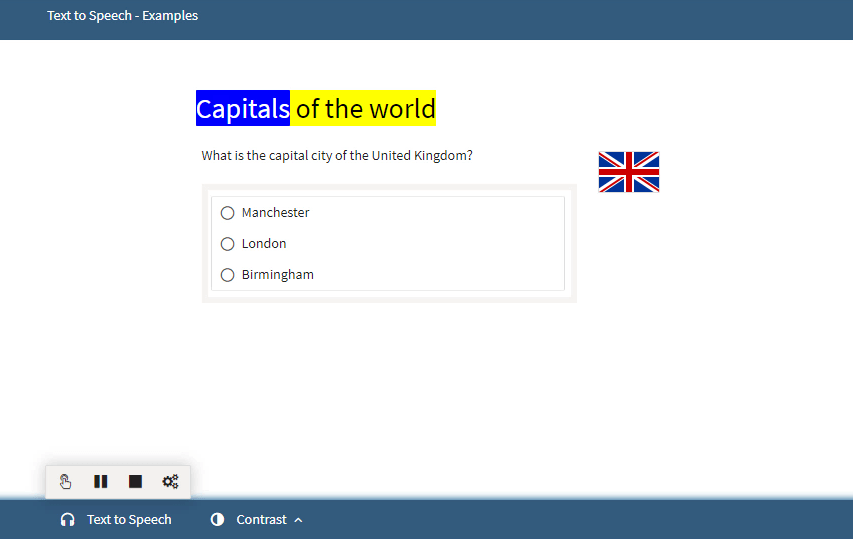

<!--
created_at: 2018-10-02
authors:         
    - "Catherine Pease"
-->

# Text-to-Speech

>[Test-takers](../appendix/glossary.md#test-taker) can elect to use the text-to-speech functionality for a [Test](../appendix/glossary.md#test).

The text-to-speech functionality allows you to hear the test questions, or parts of them, read aloud.

*Note: This functionality is only available in the Ignite Edition (or higher) of TAO.*

To activate this functionality, click on the headphones icon which appears at the bottom of the screen after beginning the test.

Four icons, representing four options, will appear:

**Hand over button:** By clicking on this and then on a specific question in the test, that question will be read aloud. The current word being read out will be highlighted.

**Play button:** The questions on the current page of the test will be read aloud if you press the play button. The current word being read out will be highlighted.

**Stop button:** This button halts the recording.

**Settings (interlocking cogs):** You can control the speed at which the question, or text, is read here.

