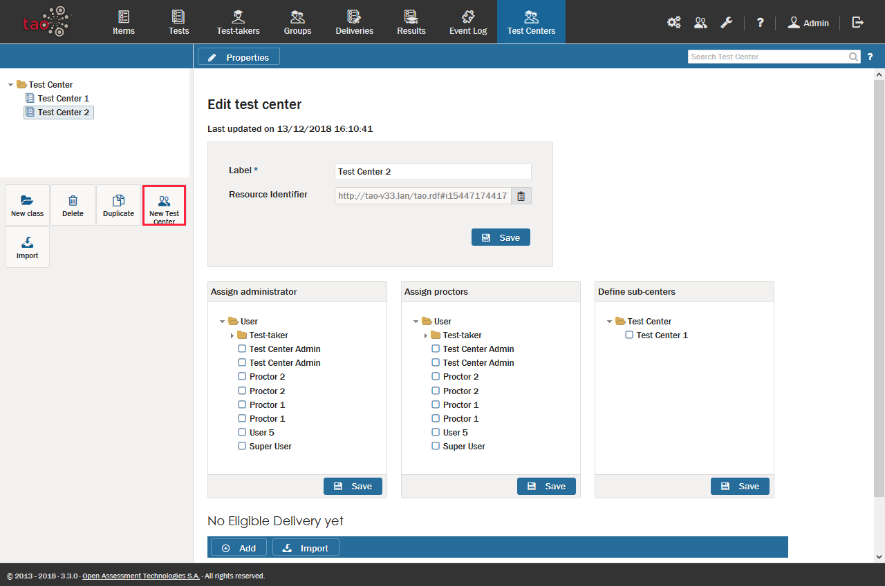

<!--
created_at: 2018-10-04
authors:         
    - "Catherine Pease"
--> 

# Creating a new Test Center

> [Test Centers](../appendix/glossary.md#test-center) deliver [Tests](../appendix/glossary.md#test) to [Test-takers](../appendix/glossary.md#test-taker).

>This section tells you how test centers are created, and which users and their associated roles need to be created for a TAO-registered test center to function.

**1.** Create a new test center. 

To create a new test center in TAO, first click on the Test Centers icon in the [Assessment Builder Bar](../appendix/glossary.md#assessment-builder-bar). This opens the Test Centers page, with the [Library](../appendix/glossary.md#library) of Test Centers on the left. 

*The last test center to be edited (either by you or a previous user) will be highlighted in the library.*

Next, click on the *New Test Center* icon in the button bank under the library. This will define a new test center in the selected folder.

Then, label your test center in the space provided on the canvas, and click *Save*.

**2.** Assign the roles which your new test center will need. 

There are three roles which need to be assigned within a test center:
 
*Administrator*: The *[Test Center Administrator](../appendix/glossary.md#test-center-administrator)* manages the
[Proctors](../appendix/glossary.md#proctor) at the test center, in other words can create and remove proctors, as well as authorize them to proctor specific deliveries. Users with this role can also proctor themselves.

*Proctor*: The *proctor* role is assigned to the person who will oversee the execution of a particular [Delivery](../appendix/glossary.md#delivery) - i.e. a delivery session. See the section on [Proctoring](../test-centers/proctoring.md) for more information on what proctoring entails.

*Sub-center*: Using the *sub-center* role, test centers can be linked to each other within a hierarchy.

See the section [Licensing a Delivery to a Test Center](../test-centers/licensing-a-delivery-to-a-test-center.md) for details on how a test center can deliver tests to test-takers.

