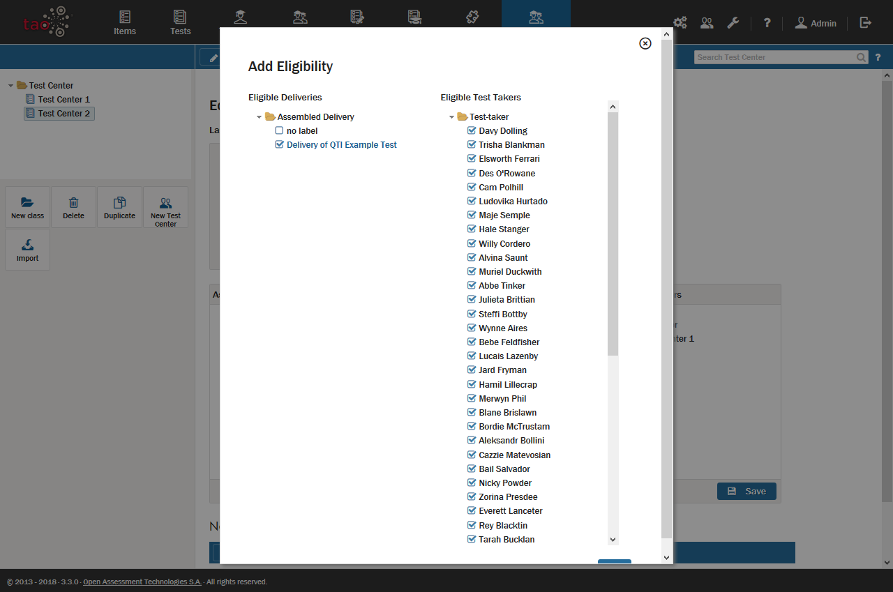

<!--
created_at: 2018-11-06
authors:         
    - "Catherine Pease"
--> 

# Licensing a Delivery to a Test Center

> In order to deliver a [Test](../appendix/glossary.md#test) - in other words, to enable [Test-takers](../appendix/glossary.md#test-taker) to sit the test - it is usually referred to a [Test Center](../appendix/glossary.md#test-center) in the form of a [Delivery](../appendix/glossary.md#delivery).
> 
> It is the task of the [Tenant Administrator](../appendix/glossary.md#tenant-administrator) to refer deliveries to the appropriate test centers. 

**Follow the steps below to enable a test center to assign a delivery:**

**1.** Select the test center which is to assign the delivery.
 
Click on the Test Centers icon in the [Assessment Builder Bar](../appendix/glossary.md#assessment-builder-bar). This opens the Test Centers page, with the [Library](../appendix/glossary.md#library) of test centers on the left. 

*The last test center to be edited (either by you or a previous user) will be highlighted in the library.*

Next, select from the library the test center you wish to assign the delivery to a group of test-takers. 

**2.** Add your delivery to their list of eligible deliveries.

At the bottom of the canvas which appears is a list of *Eligible Deliveries*. In the list are the deliveries which a test center is licensed to deliver.

Now, click on *Add* to add a delivery from your delivery library to their *Eligible Deliveries*, or click on *Import* to import a delivery from another computer.

**3.** Adjust the settings for your delivery.

Under *Actions*, to the right of the delivery you have just added, are the settings for that delivery.

**Edit:** Here, you can edit the list of test-takers eligible to take this test. Only the tenant administrator is authorized to do this. 

Clicking on *Edit* will bring up a list of all test-takers registered in the relevant TAO installation. The test-takers eligible for this test will have a tick in the box next to their name. This list can be edited. 

**Proctor/Un-Proctor:** You can toggle between these two settings. The default setting is *Proctor*. Click on *Un-Proctor* to disable proctoring, or *Proctor* to enable the delivery to be proctored. 

Proctoring can also be set when a new delivery is assembled: see the section [Create a new Delivery](../deliveries/create-a-new.delivery.md) for details.

See the section on [Proctoring](../test-centers/proctoring.md) for more information on the role of proctors, and what a proctor is authorized to do.

**Remove:** Clicking on *Remove* will remove this delivery from the list of eligible deliveries of that test center.

