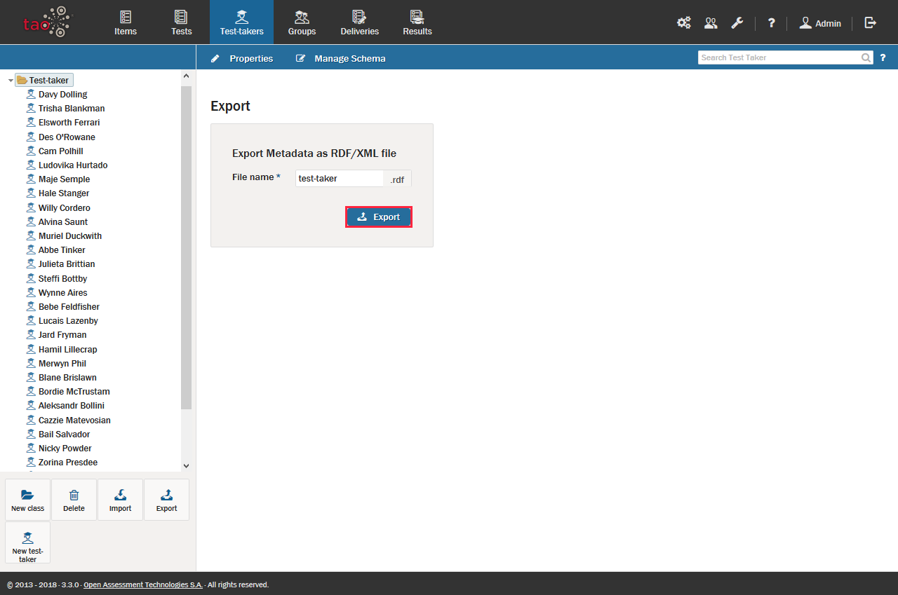

<!--
created_at: 2016-12-15
authors:         
    - "Catherine Pease"
--> 

# Exporting Test-takers

>[Test-taker](../appendix/glossary.md#test-taker) profiles may be assembled on almost any computer that has access to TAO. However, there may be situations in which sharing test-taker profiles is useful. For instance, a test-taker who has successfully passed a prerequisite course may now enroll in a more advanced study with a different teacher. Test-taker profiles can be shared in a few easy steps.

**1.**  Click on the Test-taker icon on the [Assessment Builder Bar](../appendix/glossary.md#assessment-builder-bar).

**2.**  Click on either the Test-taker folder (class) you want to export in the [Test-taker Library](../appendix/glossary.md#test-taker-library) on the left-hand side, OR click on *New class* in the button bank below the library to create a new folder for the test-takers you would like to export.

Creating a new class (i.e. a new folder) allows you to place test-takers in a distinct location in order to be transferred from one computer to another (for organized groups of students, review how to [export groups](../groups/exporting-groups.md)). When doing this, the test-taker class can be renamed in the *Edit class test-taker* dialog box in the field marked *Label*. Clicking the blue *Save* button will create the class.

*Note: An individual test-taker can be exported without creating a new class to transfer it to. It may be helpful, however, to organize the entire export from a single folder.*

**3.**  If you have created a new class for this purpose, move the test-takers which you want to transfer to this new class in the test-taker library.

This selects the test-takers which are to be exported.

**4.**  Select the class, then click *Export* in the button bank below the library.

The folder or test-taker metadata file which is to be exported should be formatted as a Resource Description Framework (RDF) file. 

**5.**  Click the blue *Export* button in the dialog box to continue with the export.

**6.**  Select the location to which you want to export your test-taker file, and then click *Save*.

The test-taker metadata can then be transferred either to a data storage device or a computer network. The next step in the transfer is to [import the test-takers](../test-takers/importing-test-takers.md) onto the desired computer.
