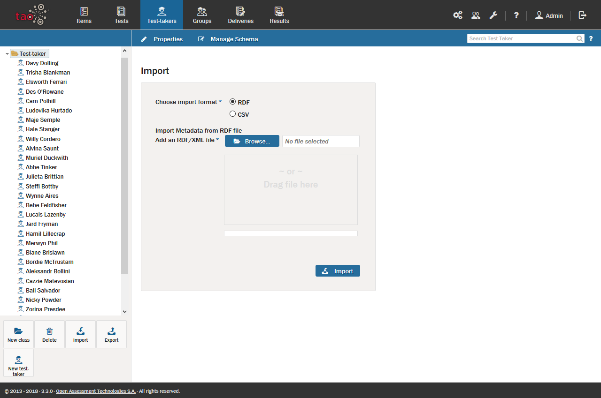
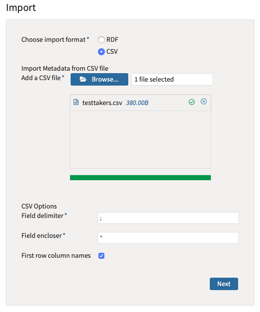
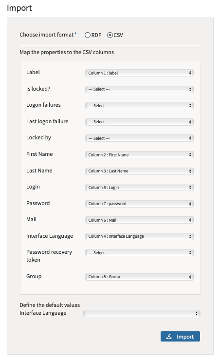

<!--
created_at: 2016-12-15
authors:         
    - "Catherine Pease"
--> 

# Importing Test-takers

>[Test-taker](../appendix/glossary.md#test-taker) metadata files can be taken from any computer and imported onto any other computer which also has access to TAO. This is done using an operation called *Import*.


**1.**  Click on the Test-takers icon on the [Assessment Builder Bar](../appendix/glossary.md#assessment-builder-bar).

This will take you to the [Test-taker Library](../appendix/glossary.md#test-taker-library), which you will see on the left.

**2.**  Click on the Test-taker class (folder) in the library in which you wish to import the new test-taker profile.

**3.**  Click on *Import* in the button bank below the library.

This opens a dialog box which asks you to select the format of the incoming test-taker metadata. The supported formats are RDF (Resource Description Framework) or CSV (Comma-Separated Values).  



**4.** Click the blue *Browse* button to find the file intended for import (alternatively, the file may be dragged and dropped into the box below the button).

**5.** Once the file is selected, click on the blue *Import* button if importing an RDF. If you are importing a CSV file you will click on the blue *Next* button.



You will then need to map the properties to the CSV columns. If you don’t have a Language column in your CSV file, then you can choose a default value for the interface language for all test-takers by choosing a needed language in *Define the default values Interface Language* and then click on the blue Import button.



This will import the test-taker's profile into the test-taker library, after which he can receive [Tests](../deliveries/create-a-new-delivery.md).

## Structure of CSV File

By default, the CSV file should follow to next rules:
Value separator: Semicolon
Row separator: Newline

```
label;First Name;Last Name;Interface Language;Login;Mail;password;Group
TAO Erica;Erica;Mayer;http://www.tao.lu/Ontologies/TAO.rdf#Langen-US;qwerty4700;mayers@tudor.lu;123456789@Qq;https://nec.local/tao.rdf#i15677754915441105
TAO Lenny;Lenny;Seert;http://www.tao.lu/Ontologies/TAO.rdf#Langen-US;qwerty5600;lenny@tudor.lu;123456789@Qq;https://nec.local/tao.rdf#i15677754915070106

```

In that example, we have 7 columns. The first line is header, next lines are values.

Required columns:
Label - a label of test-taker. That value using for the BackOffice.
Login - Login of test-taker
Password - Password of test-taker
Group - ID of group

Additional columns:
Interface Language - A language of interface of test-taker. If this column does not exist, then you should choose a default language during the import process. 
Mail - Email of test-taker
First Name/Last Name - First and last names of test-taker.

