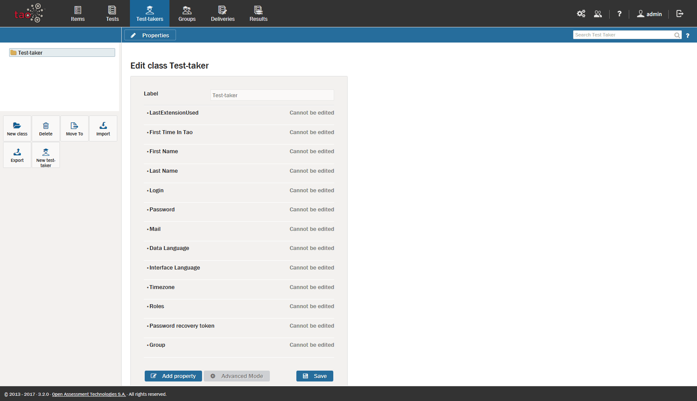

<!--
created_at: 2016-12-15
authors:         
    - "Catherine Pease"
--> 

# Test-Takers: An Overview

>[Test-Takers](../appendix/glossary.md#test-taker) are individuals who take the assessments, or [Tests](../appendix/glossary.md#test), assembled by TAO. These are typically registered students in a given class.

This section provides an overview of how to manage your test-takers, including what you need to do to register them in TAO, how to add new test-takers to [groups](../appendix/glossary.md#group) of existing test-takers, and how to re-use the same test-taker profiles in different locations. 

**1.** Creating a new test-taker

Each test-taker needs a profile which contains information including personal details and affiliation to groups. For more information on how to create these, see [Creating Test-takers](../test-takers/creating-test-taker.md).

**2.** Importing and exporting test-takers

Test-taker profiles can be imported to and exported from different storage devices, to enable them to be used in various test scenarios, including by different teachers. For more information on how to do this, see [Importing Test-takers](../test-takers/importing-test-takers.md) and [Exporting Test-takers](../test-takers/exporting-test-takers.md).

**3.** Grouping test-takers together

Test-takers can be organized into [Groups](../appendix/glossary.md#group). These are collections of test-takers who take the same [assessments](../appendix/glossary.md#test) throughout the duration of a course of study. For information on how to manage groups of test-takers, see the section [Creating a new group](../groups/creating-a-new-group.md).

