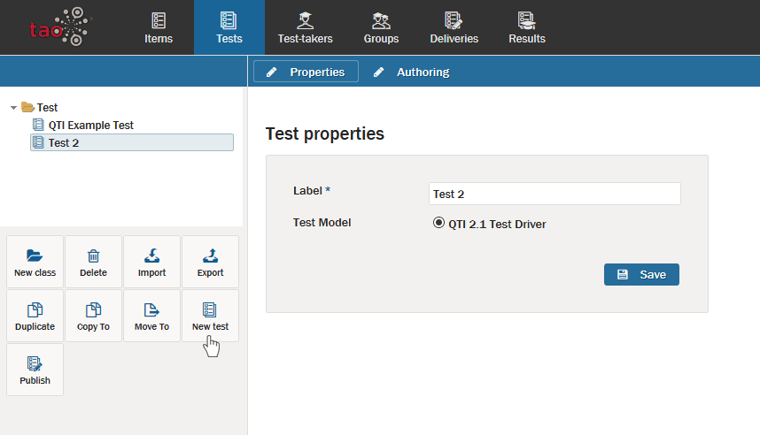

<!--
created_at: 2016-12-15
authors:         
    - "Catherine Pease"
--> 

# Creating a New Test

>TAO defines a [Test](../tests/what-is-a-test.md) as a collection of [Items](../interactions/what-is-an-interaction.md) designed to assess the academic progress of a [Test-taker](../appendix/glossary.md#test-taker). This approach allows for the rapid assembly of tests administered across computer networks. If all you have is 30 minutes to create a 10-question quiz for your 8th grade class, TAO can help.

Now, let's walk through the steps of creating a test.

**1.** Click on the Tests icon in the [Assessment Builder Bar](../appendix/glossary.md#assessment-builder-bar). 

This will take you to the Tests page, and will show the last test which you, or the user before you, created. On the left-hand side of your screen you will see the [Test Library](../appendix/glossary.md#test-library) of existing tests. The last test which was created will be highlighted in the library. In this tour, however, you will create a new test.

**2.**  Click on the *New test* icon in the button bank under the library.

This will create a new test in the highlighted folder.

*Note: To create a new test in a different folder, select the desired folder in the library, and then click on the New test icon in the button bank. To create a new folder (in TAO these represent new classes), click on New class in the button bank, and then give it a label. Highlight where to put the new folder relating to the new class.*

 
**3.**  Label and save your test.

Once you have created a new test, this will bring up a new dialog box which gives you the option of naming, or labeling your Test.

After labeling your test, click on *Save*. This produces an empty test, which you can now populate with items.

*Note: It is always a good idea to save test assembly work every ten minutes or so, to prevent losing your work.*

**4.** Click *Authoring* in the [Action Bar](../appendix/glossary.md#action-bar) to insert items into your test.

This will take you to the empty test you have created. You can now start to populate the [Canvas](../appendix/glossary.md#canvas) in the middle (the test assembly) with items.

Tests can be divided into a hierarchy of two levels: *[Test parts](../appendix/glossary.md#test-part)*, and *[Sections](../appendix/glossary.md#section)*. A *Test part* is the first tier division of a test, while a *section* is the second tier division. 

Test divisions, however, are optional, and they are added in reverse order. For instance, if a test has no divisions, all items will simply be added to Part 1 Section 1. If only one level of division is needed, adding *sections* will allow a test to be divided into two. If both levels are required, you need to add new *test parts*. To add new *sections*, click on the blue *New section* button below the existing sections in the test. To add new *test parts*, click on the blue *New test part* button below the existing test parts.

At the start of any section, a *Rubric Block*, or explanatory text, can be entered prior to the insertion of items. To do this, click on the icon with the letter "A" on it, and then click on the blue *New Rubric Block* button that appears. Add your text in the space provided.

**5.** Search for items for your test.

The [Library](../appendix/glossary.md#library) on the left shows the items which can be used in your test.

There are two ways of searching for items:

- Click on the *Item* drop-down menu above the library. The available item classes, or folders, will be shown in the library below. Click on the folder you wish to open, and the items in it will appear in the library. By selecting one of the two icons to the right of the *Item* drop-down menu you can choose to view the available items either as a list or in a tree.

- Click on the *plus* sign to the right of the *Search* box to carry out an advanced search. A dialog box will appear. Clicking on *Choose a value* in the *State* box will open a drop-down menu, which enables you to filter the available items according to their status. Items which have passed through the review process and have been approved are marked *final*, and it is recommended that you use only these items in your test. Ticking the box on the right will clear your selection. Alternatively, if you know the name of the item you are looking for, you can enter it in the *Label* box. Clicking on *Apply* will take you to that item. Click *Reset* to clear your selection.
 

From the library, select the item you wish to add, and then click on the blue button that reads *Add selected item(s) here*. 

*Note: It is easiest to add items in the order in which they are to appear in the delivered test. If an item is added out of order, however, this can be corrected by clicking the upward or downward arrow buttons which appear after the properties icon on the right of the item. Delete unwanted items by clicking on the trash can icon.*

See the [Test Settings section](../tests/tests-settings.md) for information on adjusting assessment settings such as the time/attempts to be allowed.

<aside class="optional-extras">
##Optional Extras

###Duplicating an existing test

You can duplicate an already existing test by clicking on the *Duplicate* icon in the button bank under the library. A copy will then be created in the folder of the test you have duplicated, with the same name but with "bis" on the end.

###Copying an existing test

You can make a copy of an already existing test by clicking on the *Copy to* icon in the button bank under the library. 

A dialog box will appear on the canvas. Select a destination folder, and click on *Copy*. A copy of the test will then be created in the folder you have selected, with the same name but with "bis" on the end.

###Finding an existing test

You can use the *Search Test* button on the right of the Action Bar to look for already existing tests. A list of tests with that name will appear. Click on *Open* if you want to open one of them.

###Publishing a test

If you would like to assemble a delivery once your test is complete, you can publish it directly from the Tests page, rather than going to the Deliveries page to assemble it.

Click on the *Publish* icon in the button bank under the library.

A dialog box will appear on the canvas. Select a destination folder, and click on *Publish*. A [Delivery](../appendix/glossary.md#delivery) of your test will then be created in the folder you have selected.

*Note: If the background tasks functionality is installed on your version of TAO, the publishing process will be transferred to it (shown in a circle to the left of the [Properties](../appendix/glossary.md#properties) icon on the assessment builder bar). Clicking on the circle opens the list of tasks, containing information about each one. You can see here when the delivery has been created.*   
 
Open the delivery you have created to set the delivery properties in the same way you would when you create a delivery on the Deliveries page.

###Granting user access

As an administrator, you can permit a user certain access rights to specific folders (classes), items or tests. To do this, select a folder and then click on the *Access Control* icon in the button bank under the *library*.  

This will bring up a window with the following:

- A search bar for users, with a list of users with granted access
- A search bar for roles, with a list of roles with granted access

You can define the rights of every user or role by checking the relevant boxes below:

- *Read* - allows the user to view the folder/item/test
- *Write* - allows the user to edit the folder/item/test, or to create new ones in that folder
- *Grant* - allows both of the above
 
Clicking the brown button *Remove* will delete a user or role from the list. 

*Note: Unchecking all the boxes for a specific user/role will also remove them from the list.*
 
When you have checked the correct boxes, click the blue *Save* button to save your changes.

</aside>