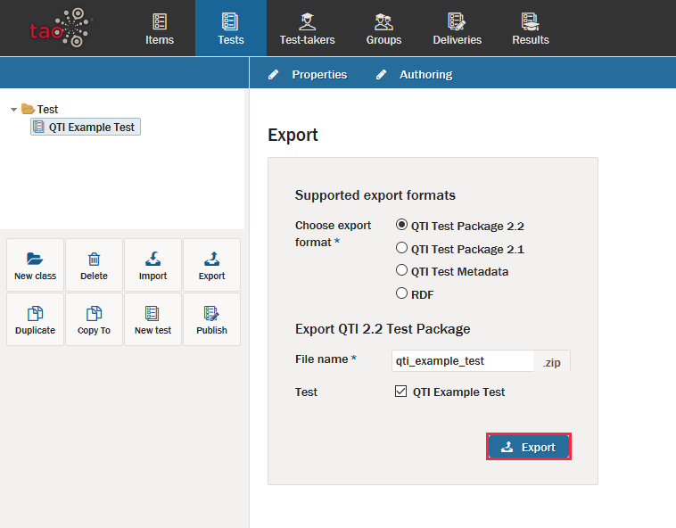

<!--
created_at: 2016-12-15
authors:         
    - "Catherine Pease"
--> 

# Exporting Tests

>[Tests](../appendix/glossary.md#test) may be assembled on almost any computer that has access to TAO. However, the capability to share tests will be useful in certain situations. For instance, a department may have standard performance expectations for its most basic courses, and these may be determined by a single test distributed to all the teachers of the department. Tests can be shared in a few easy steps.

**1.**  Click on the Tests icon in the [Assessment Builder Bar](../appendix/glossary.md#assessment-builder-bar).

**2.**  Select the class (Test folder) you want to export in the [Test Library](../appendix/glossary.md#test-library) on the left-hand side, *or* click on *New class* in the button bank below the library. This will create a new folder for the tests you would like to export.

Creating a new class (i.e. a new folder) allows you to place tests in a distinct location in order to be transferred from one computer to another. When doing this, the test class can be renamed in the *Edit test class* dialog box in the field marked *Label*. Clicking the blue *Save* button will create the class.

*Note: Individual tests can be exported without creating a new class to transfer to. It may be helpful, however, to organize the entire export from a single folder.*

**3.**  If you have created a new class for this purpose, move the tests you want to transfer to this new class in the Test library.

This selects the tests which are to be exported.

**4.**  After clicking on the class, click *Export* in the button bank below the Library.

The dialog box will ask you to choose an export format: either QTI or RDF.
If the test is to be exported as a Question and Test Interoperability (.qti) formatted document, it will save the files as a compressed .zip file. Otherwise, the export will be in Resource Description Framework (.rdf) format.

**5.**  Click the blue *Export* button in the dialog box to continue with the export.

**6.**  Select the location to which you want to export your test, and then click *Save*.

The test can then be transferred either to a data storage device or a computer network. The next step in the transfer is to [import the test onto the desired computer](../tests/importing-a-test.md).
