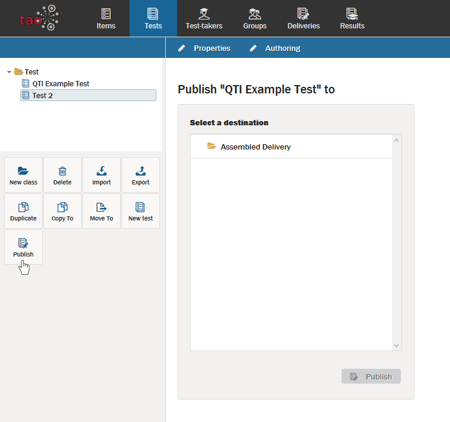

# Publishing a test

>Publishing a test means creating a [delivery](../appendix/glossary.md#delivery) for an assessment.

In TAO ther are two ways to create a delivery, you can either follow the instructions in the [delivery chapter](../deliveries/create-a-new-delivery.md) or you can publish test directly from within the test manager.

**1.**  Click on the **Publish**  icon in the button bank under the library.

This will show the dialog below:

**2.**  Select the directory in which you want to create the delivery and click on **Publish** at the bottom of the dialog. Mind you, that the library in this dialog refers to your deliveries and not your tests!

To configure the delivery you will still need to preceed as decrivbed in [delivery chapter](../deliveries/create-a-new-delivery.md).