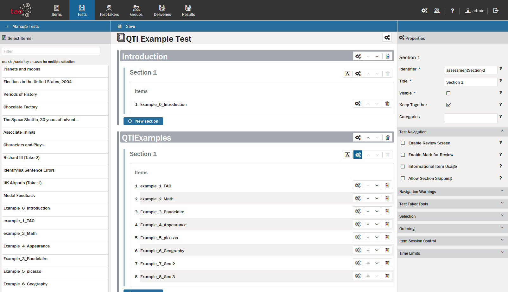
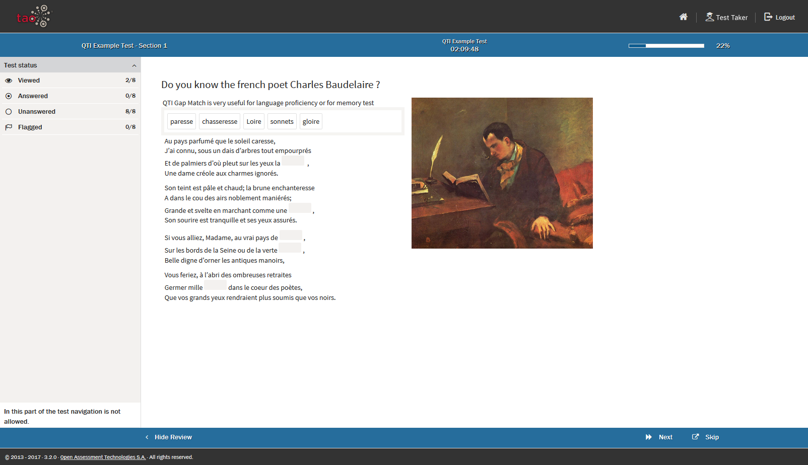
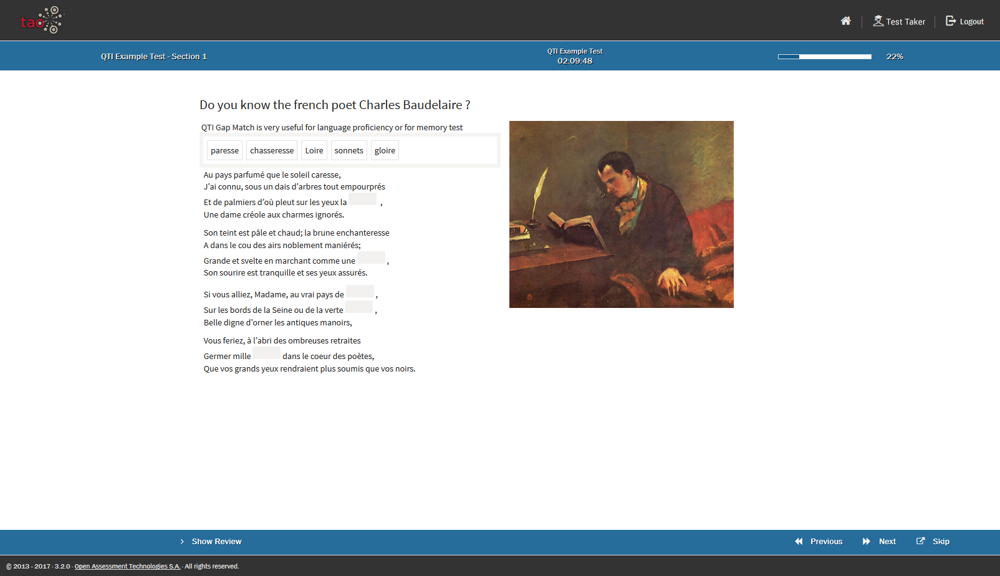
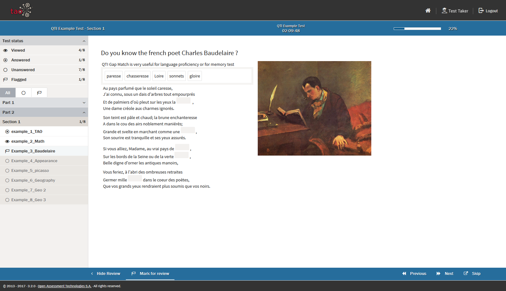
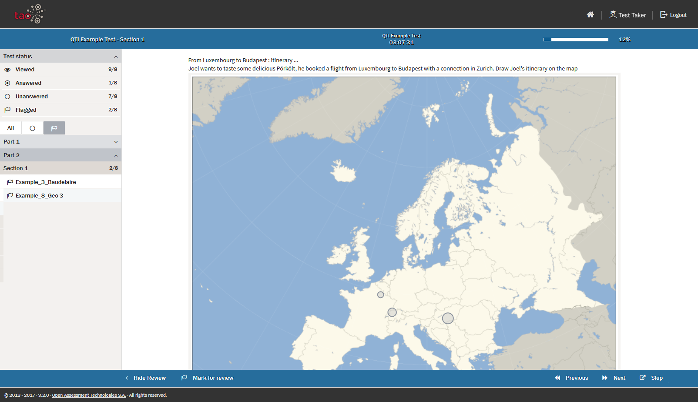

<!--
tags: []

--> 

# Test Navigation

> 

These settings are available for a whole section or on a per-item basis. Select the gears next to the section or items and click on *Test Navigation*

## Enable Review Screen

Review screen on a linear test

Review screen on a non-linear test

Review off

## Enable Mark for Review

Mark for review

Marked Items

## Informational Item Usage

## Allow Section Skipping
