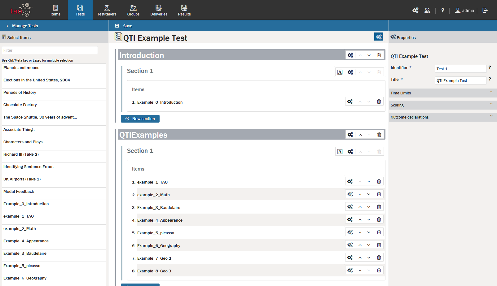
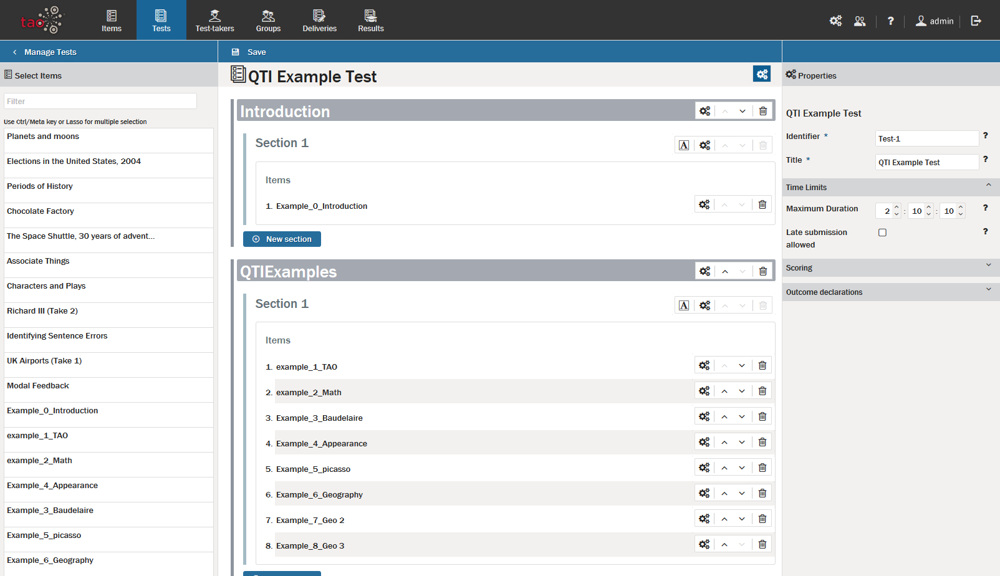
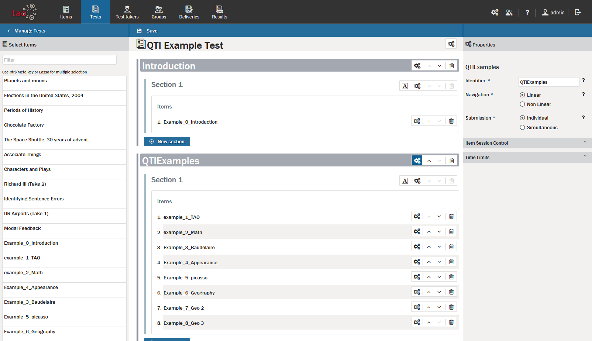
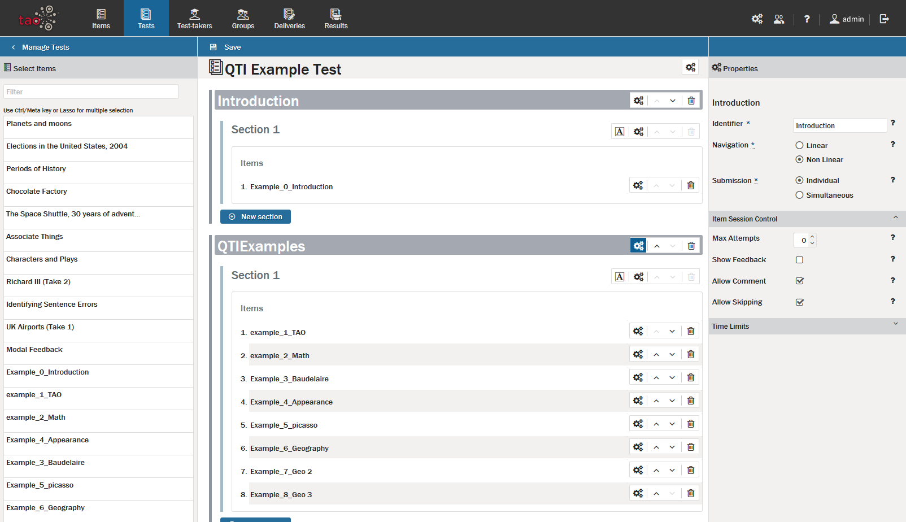
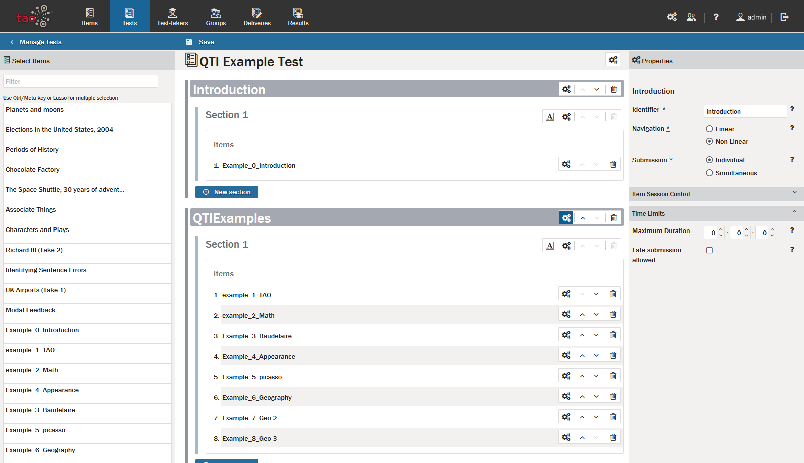
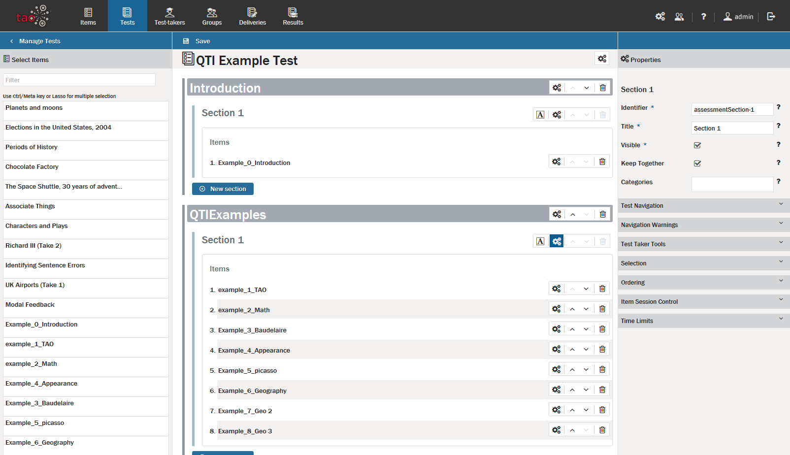
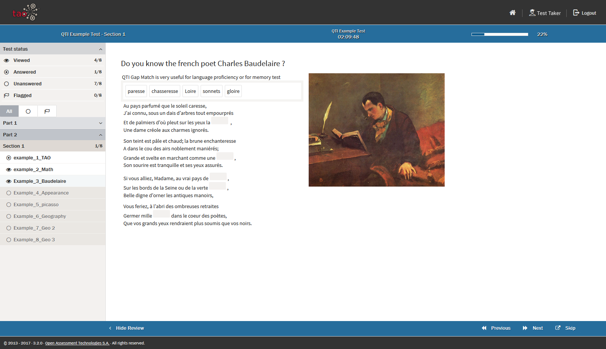
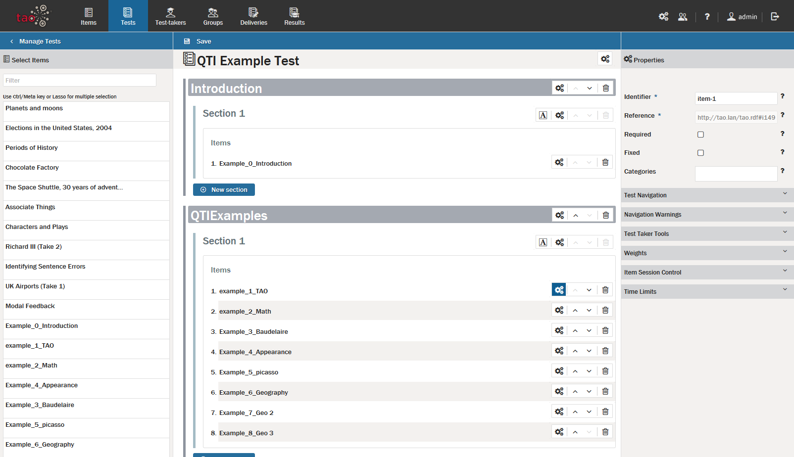

# Test Settings

> After [creating a new Test](../tests/creating-a-new-test.md), it will be necessary in most cases to set various properties for the assessment and its individual parts. There are four levels in which properties may be assigned: the [Test](../appendix/glossary.md#test) level, the [Test part](../appendix/glossary.md#test-part) level, the [Section](../appendix/glossary.md#section) level, and the [Item](../appendix/glossary.md#item) level. These properties will appear in the [Properties Panel](../appendix/glossary.md#properties-panel) on the right when you click on the appropriate properties icon (depicted as three interacting gears).

> The *Test* level properties icon can be found in the Test bar at the top of the canvas. *Test part* level properties icons can be found in each grey *Test part* bar, while *Section* level properties icons will be found on the same line as the section label. *Item* level properties icons can be found next to the item's label.

**1.** Click on the *Test* level properties icon.

This brings up four panels on the right: general properties, *Time Limits*, *Scoring* and *Outcome Declarations*. 

In the general properties, the *Identifier* box should normally be left as it is, though it is editable. However, the test *Title* can be renamed to make it easier for the [Test-taker](../appendix/glossary.md#test-taker) to identify.

In the *Time Limits* you can set a time limit for tests at either the item level or the test level. To limit the amount of time the test-taker has to complete the test, enter the maximum duration (in hours, minutes, and seconds). If late submissions are to be accepted, check the *Late submission allowed* box. If the duration is to be strictly enforced (i.e. no late submissions are allowed), leave this unchecked.

See the section on [Scoring Rules](../tests/test-scoring-and-outcome-declarations.md) for more information on *Scoring* and *Outcome Declarations*.

**2.** Click on the *Test-part* level properties icon.

This brings up three panels on the right: a general properties panel, an *Item Session Control* panel, and a *Time Limits* panel. 

In the general properties panel, the *Identifier* box should be renamed as appropriate. 

The *Navigation* box, or how the test-taker is allowed to answer questions, should be selected as either linear (first question first, second question second, etc.) or non-linear (can be answered in any order). 

Select the *Submission* mode as either individual (submitted response by response) or simultaneous (submitted on completion of the *test-part*) by clicking in the appropriate box.

In the [Item Session Control Panel](../appendix/glossary.md#item-session-control-panel), set the following four properties: 

Set *Max Attempts* to the number of attempts the test-taker may have (the default setting 0 permits an unlimited number of attempts). 

Check the *Show Feedback* box if the test-taker should see the modal feedback (instant feedback) after completing this test-part. 

Check the *Allow Comment* box if the test-taker may provide explanations for responses, or leave feedback for the test. 

If configured on the server, the *Allow Skipping* box will be visible. This setting will allow the test-taker to pass on answering questions within the test-part if checked.

Check the *Validate responses* box if only responses which are valid should be accepted. If this box is checked, constraints governing the test-taker's response (such as if the minimum and maximum choices specified for that question have been given) will be checked before the test-taker can proceed to the next question.

The time limits section is similar in nature to the time limits section for the test level properties, except that the settings apply to the current test-part only.

**3.** Click on the *Section* level properties icon.

This brings up eight panels on the right: general properties, *Test Navigation*, *Navigation Warnings*, *Test-taker Tools*, *Selection* properties, *Ordering*, *Item Session Control*, and *Time Limits*. The last two panels are the same as the last two in the test part properties, while the first six panels differ from previous levels. 

*Note: In the Ignite/Premium Edition of TAO, tests can be configured at section level to provide test-takers with the option of hearing the test content as well as reading it. This text-to-speech functionality allows the test-taker to hear the test questions, or parts of them, read aloud. See the chapter on [Enabling text-to-speech](../premium-edition-features/enabling-text-to-speech.md) for more information.*

The general properties include an identifier and title: the default name in the *Identifier* box should generally be maintained, while the *Title* can be changed to suit the test. In general, the *Visible* box should be checked (or else the test-taker is unable to see the section), and the *Keep Together* box should also be checked if it is important that the entire section be completed before moving onto the next section. *Categories* act as tag references, which may be displayed to the test-taker.

In the *Test Navigation* panel, if *Enable Review Screen* is checked, a review panel will appear on the left when a test-taker is taking the test.

The Review Panel in the example above shows a non-linear test. See the section on the [Review Panel]({UG}/taking-a-test/review-panel.md) for more information on how it can be used. 

If *Enable Mark for Review* is checked, the test-taker has the option of flagging items in the test (to be able to return to them later). Check *Informational Item Usage* if the item has been included in the test for informational purposes only. This prevents the item being treated as a question. 

In the *Navigation Warnings* panel, check the boxes where you would like the test-taker to receive (or *not* receive) the warning in question.

In the *Test-taker Tools* panel, set the tools which should be made available to the test-taker for this section. See the section on [Test-taker Tool Configuration](../tests/test-taker-tool-configuration.md) for more information on the tools available.

The *Selection* panel asks if the delivered test section should include only some of the items assigned it (*Enable selection* ), and if so, how many (*Select*). If *With Replacement* is checked while the selection mode is enabled, then questions may be repeated. Normally, they are only allowed to be used once in a Test sitting.

*Ordering* contains only one property setting, which is *Shuffle*. This setting randomizes the question order.

For *Item Session Control* and *Time Limits*, see the descriptions in the test-part properties above.

**4.** Click on the *Item* level properties icon.

This brings up seven panels: general properties, *Test Navigation*, *Navigation Warnings*, *Test-taker Tools*, *Weights*, *Item Session Control*, and *Time Limits*.

The last two panels are the same as the last two in both the test-part and section level properties. The three panels after the general properties (*Test Navigation*, *Navigation Warnings* and *Test-taker Tools*) are the same as in section level properties.

*Note: In the Ignite/Premium Edition of TAO, the text-to-speech functionality (described above for section level properties) can be also configured at item level.*

The general properties include entries for: *Identifier*, *Reference*, and *Categories*. It also includes check boxes to indicate if the item is *Required* and if it is *Fixed*.

The *Identifier* and *References* boxes generally do not require modification. *Categories* act as tag references which may be displayed to the test-taker. If the *Required* box is checked, the item will appear in the test, even if less than the total number of items appears in a given test (in a section where selection is enabled). If the *Fixed* box is checked, the item will appear in a particular order, even if the section ordering calls for shuffling. Categories are not displayed to the test-taker; typically they are used to calculate aggregate scores (e.g. on sub-domains). For more information, see the section on [Scoring Rules](../tests/test-scoring-and-outcome-declarations.md).

For *Test Navigation*, *Navigation Warnings* and *Test-taker Tools*, see the description in the section level properties above.

In the *Weights* panel, the weight of that item can be adjusted. It is also possible to add further weights if you wish to enable the item to be scored in different ways for different tests. (The weight value to be used for a specific test should be selected in the *Weight* box in the *Scoring* panel in the test properties section above.)The default weight value for each item is 1. The section on [Scoring Rules](../tests/test-scoring-and-outcome-declarations.md) gives more information on weights.

For *Item Session Control* and *Time Limits*, see the descriptions in the test-part properties above.
