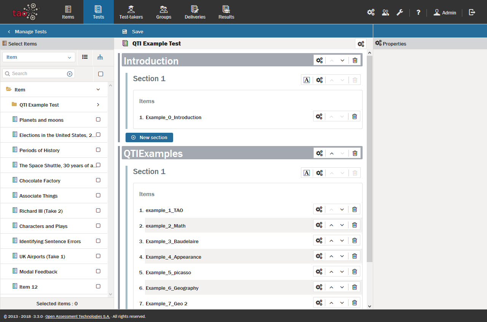

<!--
created_at: 2016-12-15
authors:         
  - Catherine Pease
--> 

# What is a Test?

*"A test is a group of Items with an associated set of rules that determine which of the items the candidate sees, in what order, and in what way the candidate interacts with them. The rules describe the valid paths (order of questions) through the test, when responses are submitted for response processing (grading), and when (if at all) feedback is to be given."* - Question and Test Interoperability standard, published by IMS Global

>[Tests](../appendix/glossary.md#test), or assessments, define the continuity between [Items](../items/what-is-an-item.md), how they are ordered, and how they are presented to the [Test-taker](../appendix/glossary.md#test-taker). They also define the constraints and settings, including those related to time and navigation policies. Tests may be built from building blocks called *Item Sections* that logically sort Items into groups, making configuring a Test easier.

In TAO, assessments are assembled from individual items that are later delivered to test-takers through an automated [Delivery](../deliveries/what-is-a-delivery.md) system. If there are enough items within a test, they can be sorted and grouped into item sections according to any logical set of criteria.

Tests should be given an appropriate title which helps test-takers to accurately identify the assessment if it appears in a list of other assessments which the test-taker must also take at the same time. 

Test designers must consider issues such as whether the test-taker will need to follow a linear path (a specific question order with no option to revisit questions later) or if they can instead use a non-linear route (where questions can be answered in any order and revisited if desired). Time limitations and feedback are also important elements in successful test design.
