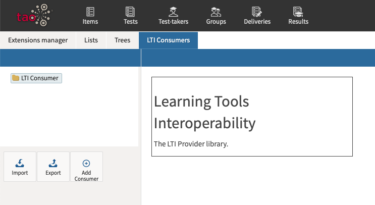
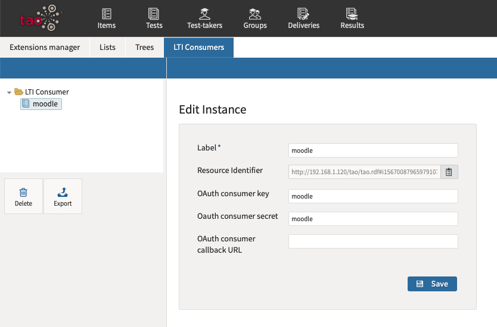
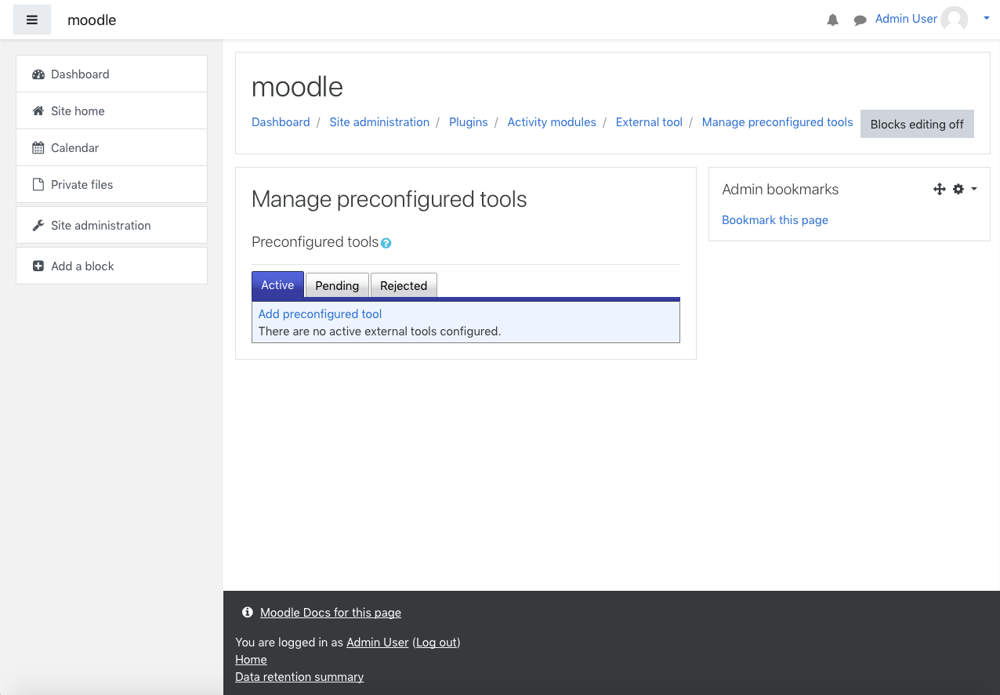
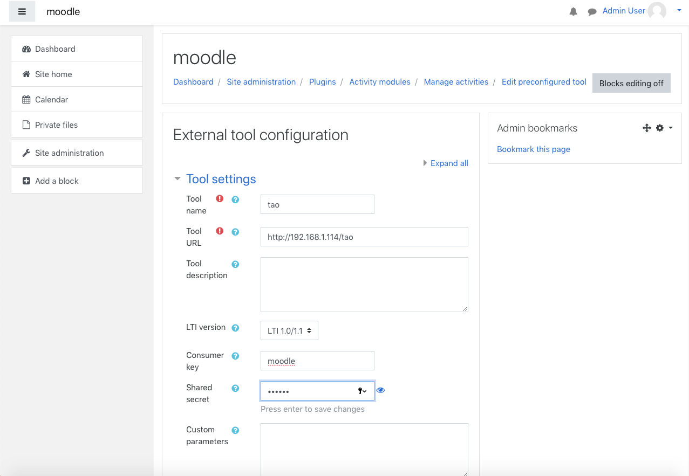
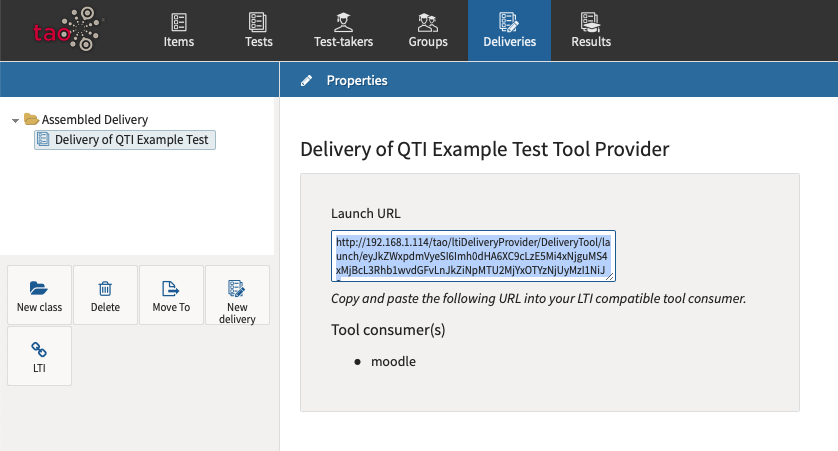

# Using LTI Consumers with TAO Deliveries

> Through [IMS Global Learning Consortium's Learning Tool Interaction (LTI) standard](http://www.imsglobal.org/activity/learning-tools-interoperability), LTI users of applications can make use of TAO-designed tests and deliver them to students through an LTI platform, such as the Moodle platform which is also Open Source. 

> "The principal concept of LTI is to establish a standard way of integrating rich learning applications (often remotely hosted and provided through third-party services) with platforms like learning management systems, portals, learning object repositories, or other educational environments." (IMS Global Learning Consortium) 

For explaining how to connect TAO to an LTI consumer, we will be utilizing the Moodle Open Source project though you could similarly attach TAO to any LTI compliant application.

In this scenario, test authors can take advantage of the ease of using TAO to create their Items and Tests while using the Moodle platform to deliver the Tests in their LMS. As an administrator, you must have Administrator privileges for both TAO and Moodle. As a teacher, you must have Teacher privileges in Moodle and Test Delivery privileges in TAO.

The LTI interconnectivity must be set up prior to executing the delivery.

## Setting up a TAO-Moodle delivery as an LTI Administrator

**1.** Ensure that TAO is configured for LTI.

You will need to verify that the *ltiDeliveryProvider* is installed, instructions for accessing and installing an extension can be found on the [Extensions Manager]({AG}/management/extensions-manager.md) page. 

To manage *LTI Consumers*, hover over the cogs  icon in the [Assessment Builder Bar](../appendix/glossary.md#assessment-builder-bar) and select *LTI Consumers*. 

Select the LTI Consumer class (folder), and click on *Add Consumer*. Name (*label*) the new consumer, and fill in an easy-to-remember *consumer key* and *consumer secret* (this is used during integration).

*Note: The *consumer key* and *consumer secret* must contain only alphabetical and numeric characters.*

The callback URL can be left blank. Finally, click on *Create*. If the consumer does not immediately appear, reload the page and it should come up. Record the URL of the page - this is your Tool Base URL.

**2.** Ensure Moodle is correctly configured.

Go to Site Administration in the Moodle platform. The following are for version 3.7, if your version differs refor to the appropriate Moodle documentation.

Go to *Site Administration* and then click on the  *Plugins* tab. In the *Activity modules* section, click on *Manage Activities*. Go to the *External tool* and then click on *settings*.

To configure TAO in the Moodle, click on  *Add preconfigured tool*. Add an appropriate name to the new configuration as the Tool name. 

Next enter the Tool URL which will be `TAO_ROOT_URL` + `/ltiDeliveryProvider/DeliveryTool/launch`. (If you don't know the URL of your TAO installation, return to the TAO *back office* home, and copy the URL, removing `tao/Main/index` from the end. For example, if your TAO home is `http://<hostname or IP>/tao/tao/Main/index`, then your root URL would be `http://<hostname or IP>/tao/`.)

Last, enter the Consumer key and Shared secret which you used in TAO and then click on *Save Changes*.

## Executing a TAO delivery in Moodle as an LTI Teacher

**1.** Create and Compile a new [Delivery](../appendix/glossary.md#delivery) within TAO.

Follow the steps used in [Create a New Delivery](../deliveries/create-a-new-delivery) to create your Delivery. Click on the Delivery you just created and then click on the  icon and then copy the Launch URL that this action generates.

**2.** Deliver the test in Moodle.

First, open your course in *edit* mode, then click on *Add an activity or resource*. Select *External Tool*, and click *Add*. 

Give the activity an appropriate name and then paste the URL taken from TAO in the previous step into the *Tool URL* field. This should produce a green check mark to the right of the URL. 

Finally, click *Save* and then return to the course. Your TAO delivery should now have been added to the Moodle course.

**3.** Test out the Delivery in Moodle.

Log in using a test account, i.e. a [Test-taker](../appendix/glossary.md#test-taker) profile set up for test purposes, to ensure that the delivery works as planned. Select the course and then click on the activity. If everything works as desired, no further action will be required. If not, then you will need to troubleshoot the delivery in TAO, ensuring that it is fully functional.
