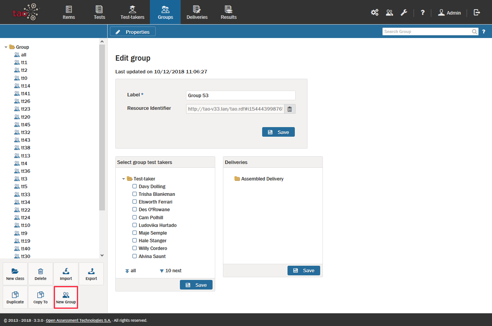

<!--
created_at: 2016-12-15
authors:         
    - "Catherine Pease"
--> 

# Creating a New Group

>[Groups](../appendix/glossary.md#group) are organized collections of [Test-takers](../appendix/glossary.md#test-taker) who take the same assessments throughout the duration of a course of study. Examples of a group include Laboratory Sections, Discussion Groups, or any cohort or subdivision of students assessed using the same examinations, test administrators, and grading criteria as others within their group. Since a group is made up of individual test-takers, it is necessary to enter the meta-data for each test-taker prior to assigning test-takers to groups.

Now, let's walk through the steps of creating a group.

**1.** Click on the _Groups_ icon  in the [Assessment Builder Bar](../appendix/glossary.md#assessment-builder-bar).

This will take you to the Groups page, and will show the last group which you, or the user before you, created. On the left-hand side of your screen you will see the [Group Library](../appendix/glossary.md#group-library) of existing groups. The last group which was created will be highlighted in the library. In this tour, however, you will create a new group.

**2.**  Click on the *New Group* icon  in the button bank under the library to create a new group.

This brings up dialog box entitled *Edit group* for the newly created group. If desired, rename the group through the *Label* field, and then click the blue *Save* button.

*Note: To create a new group in a different folder, select the desired folder in the library, and then click on the New Group icon in the button bank. To create a new folder (in TAO these represent new classes), click on New class in the button bank, and then give it a label. Highlight where to put the new folder relating to the new class. (Do not confuse Class with Group - 'Class' in this instance means a folder, while a 'Group' means a class, section, or any other cohort of students).*

**3.** Populate the group.

To the right of the *Edit group* pane are two other panes: the *Select group test takers* pane on the left, and the *Deliveries* pane on the right. To select test-takers for your group, check the boxes by the relevant names in the left pane, and then click the blue *Save* button for that pane. If a delivery has already been assembled for this group, it will appear in list of deliveries in the right pane. It should be selected before clicking the blue *Save* button for that pane.
